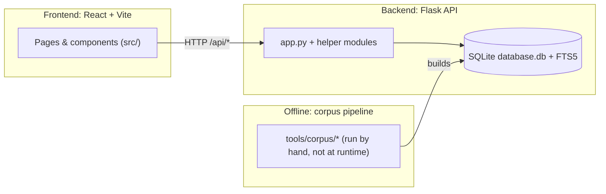
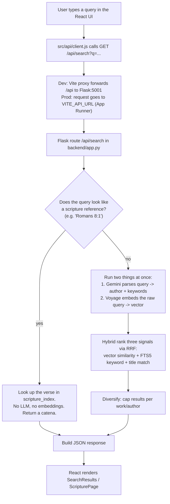

# Module 1 — Orientation & mental model

**Goal of this module:** build the map in your head before we read a single function. By the end you should be able to draw the system on a whiteboard and explain what happens when a user types a search.

---

## 1. What the product is

Ask the Early Church is a free web library for reading and searching the writings of the early Church Fathers (theologians from roughly the 1st–5th centuries). Three core features:

1. **Search** — type a natural-language question ("what did Chrysostom teach about the Eucharist?") and get back the most relevant passages.
2. **Browse** — explore the corpus by category (Church Fathers, councils, liturgies, apocrypha) and by author.
3. **Scripture browser** — pick a Bible verse and read every Father's commentary on it side by side (a "catena").

The whole thing is built on a corpus of ~52,869 passages from ~247 authors, stored in a single SQLite database.

## 2. The three big pieces



- **Frontend (`src/`)** — a React 18 single-page app built with Vite. It renders the UI and calls the backend over HTTP. It never touches the database directly.
- **Backend (`backend/`)** — a Python Flask API. It owns the database, runs the search engine (embeddings + full-text search + LLM query parsing), and returns JSON.
- **Offline pipeline (`tools/`)** — scripts you run **by hand** to build and maintain the database (scrape sources, import, clean, index, embed). These are *not* part of the running server. Think of it as the "factory" that produces `database.db`; the backend is the "store" that serves it.

This separation is the single most important mental model. **Runtime** (frontend + backend) is what users hit. **Build time / offline** (tools) is how the data got there. Keeping data preparation out of the request path is why the server can be small and fast.

## 3. What happens during a search (the request lifecycle)

This is the flow you will be asked to explain in an interview. Memorize it.



Key takeaways:

- **Scripture references short-circuit.** "Romans 8:1" never hits an LLM or the embedding model — it's a direct database lookup. Cheap and instant.
- **Two slow external calls run in parallel.** The Gemini parse and the Voyage embedding both take a network round-trip. They don't depend on each other, so the code fires them at the same time and waits for the slower one (instead of adding the two latencies). This is a real, defensible latency optimization.
- **"Hybrid search" = combine semantic + keyword.** Vector search understands *meaning* ("Eucharist" ≈ "Lord's Supper"); keyword search (FTS5) nails *exact terms*. Fusing both beats either alone. We cover the fusion math (reciprocal rank fusion) in Module 6.
- **Graceful degradation.** If Gemini, Groq, and Voyage all fail or the monthly budget is spent, search falls back to keyword-only and still returns results. It never returns a 500 because an AI provider hiccuped.

## 4. The repository map

```
ask-the-early-church/
├── README.md              # The project's own deep-dive docs (excellent — read it)
├── Dockerfile / prestart.sh # (in backend/) Container image + boot-time DB fetch — the live AWS deploy
├── package.json           # Frontend dependencies + npm scripts
├── vite.config.js         # Frontend build tool config (incl. the /api dev proxy)
│
├── backend/               # The Flask API (Python)
│   ├── app.py             # THE server: routes, search engine, security middleware (1,463 lines)
│   ├── database.py        # Creates the SQLite schema + FTS index
│   ├── load_secrets.py    # Pulls API keys from macOS Keychain / env
│   ├── utils.py           # Text cleaning + vector helpers
│   ├── query_parsing.py   # Turns a query into FTS terms + detects author names
│   ├── scripture_parse.py # Detects "Romans 8:1" style references
│   ├── ranking.py         # Reciprocal rank fusion + diversification
│   ├── search_cache.py    # In-memory TTL caches for the search hot path
│   ├── telemetry.py       # Logs AI calls + enforces the monthly $ budget
│   ├── embed_passages.py  # OFFLINE: generate Voyage vectors for the corpus
│   ├── requirements.txt   # Python dependencies
│   ├── Dockerfile         # Container image for the backend
│   ├── prestart.sh        # Fetches database.db from S3 (or HTTPS) on boot
│   └── tests/             # pytest smoke + parsing tests
│
├── tools/                 # OFFLINE corpus pipeline (run by hand, never imported by the server)
│   ├── generate_seo.py    # Builds sitemap.xml + topic pages from the DB
│   └── corpus/            # scrape -> import -> migrate -> repair -> index -> embed
│
├── src/                   # The React frontend
│   ├── main.jsx           # Entry point: mounts React, sets up the router
│   ├── App.jsx            # Home page: search state + routing
│   ├── *Page.jsx          # One file per route (Browse, Scripture, Read, Author, Topic...)
│   ├── api/client.js      # The single place that knows the API base URL
│   ├── components/        # Reusable UI pieces
│   ├── hooks/             # Reusable stateful logic (useLibrary, useSavedPassages...)
│   ├── theme/             # Light/dark theming
│   ├── utils/             # Client-side helpers (incl. HTML sanitization)
│   └── constants/         # Static config (category definitions)
│
└── public/                # Static assets served as-is (icons, sitemap, robots.txt, manifest)
```

## 5. Where the code runs (the deployment picture)

There are three environments to keep straight:

| | Frontend | Backend | Database |
|---|---|---|---|
| **Local dev** | Vite dev server on `localhost:5173` | Flask on `localhost:5001` | local `database.db` file |
| **Production (AWS, 2026)** | S3 (private) + CloudFront | App Runner (Docker container) | `database.db` pulled from S3 on boot |
| **Previous** | Netlify (static files) | Render (Python + gunicorn) | `database.db` pulled from Cloudflare R2 on boot |

The migration off Netlify/Render/R2 onto AWS is covered end-to-end in **Module 11 §9** and `docs/aws-migration-guide.md`; the key point is that the app was portable enough to move hosts with almost no code change. Two things still worth understanding about how the process is configured:

- **The backend start command** lives in the container's `Dockerfile` `CMD` (`backend/Dockerfile`): `./prestart.sh && gunicorn -w 1 -b 0.0.0.0:${PORT:-5001} --timeout 60 app:app`. Note `-w 1`: **one** worker process, so the big embedding matrix lives in RAM exactly once (it fits the instance's memory). App Runner injects `PORT`. (The older `render.yaml:21` used `-w 1 --threads 8` for the same reason — one worker for memory, threads for I/O-bound concurrency while requests wait on the Gemini/Voyage calls.)
- **The frontend build** is `npm run build` → `dist/` (`netlify.toml:2` on the old stack; on AWS the same `dist/` is synced to the S3 bucket).

(`render.yaml` and `netlify.toml` were deleted from the repo once the migration finished — where this guide cites them, it's describing the old stack for contrast. They're recoverable from git history.)

The "one worker" decision is a great interview talking point: it trades horizontal scaling for memory efficiency, which is correct *for this specific workload* (read-only shared data + I/O-bound requests).

## 6. The skills map — what each part teaches you

This project is a deliberately complete slice of modern fullstack-plus-AI engineering. Here's what owning each area gives you:

| Area of the codebase | Transferable 2026 skill |
|---|---|
| `backend/app.py` routes | Designing REST APIs |
| `database.py`, FTS5, `scripture_index` | Relational modeling + full-text search |
| `_load_embeddings`, `embed_passages.py`, Voyage | **Vector embeddings** and how to store/serve them cheaply |
| `/api/search` + `ranking.py` | **RAG-style retrieval, hybrid search, reciprocal rank fusion** |
| Gemini/Groq/local fallback | **Using LLMs as a component** with fallbacks and budget guards |
| `search_cache.py`, `telemetry.py` | Caching and **AI cost control** (the thing that separates demos from production) |
| Security middleware in `app.py` | CORS, CSP, rate limiting, XSS/SQL-injection defense |
| `src/` React app | Component architecture, hooks, client-side state, routing |
| `passageText.js` | Safely rendering untrusted HTML (XSS) |
| `tools/corpus/*` | **ETL / data pipelines** that feed an AI system |
| `backend/Dockerfile`, `prestart.sh`, `ci.yml` (+ AWS: App Runner, S3, CloudFront) | Containerization, cloud deploy, CI/CD |
| `tools/generate_seo.py`, sitemap | Making a JavaScript SPA discoverable by search engines |

## 7. Check yourself

You understand this module if you can answer:

1. Which of the three big pieces talks to the database, and which never does?
2. Why does "Romans 8:1" not cost any money to search, but "what is grace?" does?
3. Why are the Gemini parse and the Voyage embedding fired in parallel instead of one after the other?
4. Why does the production backend run **one** worker process instead of several?
5. What is the difference between "runtime" code and the `tools/` pipeline?

Next: [Module 2 — Running it / dev environment](02-dev-environment.md).
