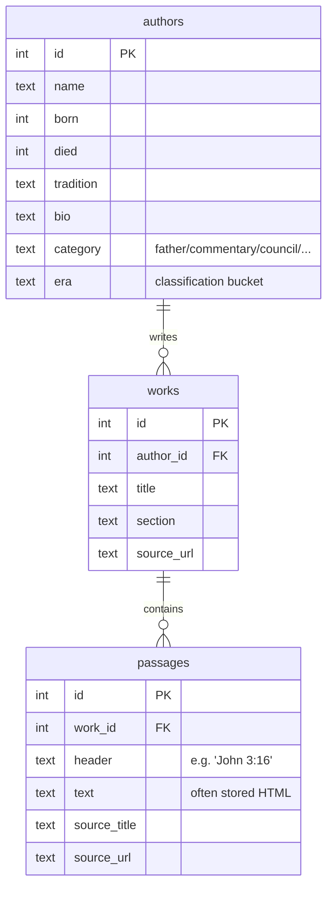

# Module 3 — The data layer (SQLite + FTS5)

**Goal:** understand the database that everything else serves. By the end you'll know the schema, how full-text search is wired, and the one rule that keeps the derived tables honest.

---

## 1. Why SQLite (and why that's a strong choice here)

SQLite is a database that lives in a **single file** (`database.db`) — no server process, no network, no separate install. People dismiss it as a "toy," which is wrong: it's the most-deployed database on earth and is excellent when:

- the data is **read-heavy and rarely written** (here: the corpus only changes when you re-run the offline pipeline), and
- the working set **fits on one machine** (here: ~53k passages, a few hundred MB).

That's exactly this workload. Using Postgres would add an entire server to operate for zero benefit. Being able to *justify* "SQLite because the corpus is read-only and single-node" is a senior-level instinct — most people reach for a heavyweight DB by reflex.

The whole DB is created/served in `backend/`, and in production the file is fetched from cloud object storage (AWS S3; Cloudflare R2 previously) on boot by `prestart.sh` rather than committed to git (it's large and not source code).

## 2. The core schema — `backend/database.py`

Three tables carry the content, in a simple hierarchy: an **author** writes **works**, and a work is split into **passages**. `database.py` also creates four supporting tables — `scripture_index` (section 4), `passages_fts` (section 3), and the two batch-job tables `embeddings` and `editorial_cleaned` — so that a freshly created database is one the server can actually boot against.

That last point is worth understanding, because it was broken until recently. `app.py` counts rows in `embeddings` at *import* time (`_load_embeddings`, Module 5), so a database without that table doesn't merely return errors from an endpoint — the process won't start:

```
sqlite3.OperationalError: no such table: embeddings
```

The rule this illustrates is general: **the setup script's output has to satisfy everything the app touches on startup**, not just the tables you think of as "yours." Schema scripts drift out of sync with the app when new tables arrive through migrations and nobody backports them to the first-run path.



The definitions (`database.py:36-79`):

```python
CREATE TABLE IF NOT EXISTS passages (
    id INTEGER PRIMARY KEY AUTOINCREMENT,
    work_id INTEGER,
    header TEXT,            -- section label; for commentaries this is "John 3:16"
    text TEXT,             -- the content, often HTML from CCEL/New Advent
    source_title TEXT,
    source_url TEXT,
    FOREIGN KEY (work_id) REFERENCES works(id)
)
```

Things to notice:

- **`id INTEGER PRIMARY KEY AUTOINCREMENT`** — every table has a synthetic integer id. In SQLite, an `INTEGER PRIMARY KEY` *is* the table's `rowid` (its physical row address), which makes lookups by id very fast. Remember this — it's the hinge for FTS5 below.
- **`FOREIGN KEY`** declares the relationship (a passage's `work_id` points at a `works.id`). Note: SQLite only *enforces* foreign keys if you turn them on per-connection with `PRAGMA foreign_keys = ON` (you can see the migration do exactly that at `migrate_schema.py:285`).
- **`header`** is the most important column for this app's identity. For a commentary passage it holds a scripture reference like `"Romans 8:1-4"`. That single text field is what powers the entire verse-by-verse scripture browser — by being parsed into a structured index (section 4).
- **`text` is often HTML.** The corpus was scraped from sites like CCEL and New Advent, so passages carry markup. This matters twice later: full-text search must strip the HTML so you don't match on tag names, and the frontend must sanitize the HTML before rendering it (Module 9).

- **`category` and `era`** arrived later, added to existing databases by `migrate_schema.py` as `ALTER TABLE`s. `database.py` now declares them in the `authors` DDL *and* re-adds them via `ALTER TABLE` when they're absent (`database.py:64-68`), so it both creates a correct fresh DB and repairs an old one. `/api/authors` selects `authors.category` and `authors.era` directly, which is why their absence was fatal rather than cosmetic.

`CREATE TABLE IF NOT EXISTS` makes the script safe to re-run — it won't error if the tables already exist. The one statement that is *not* idempotent is the FTS rebuild at the end (section 3), which drops and recreates the index unconditionally.

## 3. Full-text search with FTS5 — the clever part

A normal `WHERE text LIKE '%grace%'` scan over 53k rows is slow and dumb (it can't rank, can't handle word stems, scans every row). SQLite ships **FTS5**, a full-text search engine built in. The app creates a *virtual table* that indexes the passage text for fast keyword search with relevance ranking (BM25).

`database.py:122-136`:

```python
cursor.execute("DROP TABLE IF EXISTS passages_fts")
cursor.execute("""
    CREATE VIRTUAL TABLE passages_fts USING fts5(
        text, author_name, work_title,
        content='', content_rowid=id
    )
""")
cursor.execute("""
    INSERT INTO passages_fts(rowid, text, author_name, work_title)
    SELECT p.id, p.text, a.name, w.title
    FROM passages p
    JOIN works w ON p.work_id = w.id
    JOIN authors a ON w.author_id = a.id
""")
```

Decode this:

- **`USING fts5(...)`** creates a virtual table — it looks like a table but is backed by the FTS5 search engine. It indexes three columns: the passage `text`, the `author_name`, and the `work_title`. So a keyword query can match the body *or* the author *or* the title.
- **`content=''`** makes it an **external-content** ("contentless") FTS table. Normally FTS stores its own copy of the text, doubling storage. `content=''` says "don't store the original text, just the search index" — the original lives in `passages`. This saves a lot of disk.
- **`content_rowid=id`** is the link back. Each FTS row's `rowid` is set to the matching `passages.id`. So when FTS says "rows 12, 88, 415 match `eucharist`," the app joins those rowids straight back to `passages.id` to fetch the real content. This is why `passages.id` being the `rowid` (section 2) matters.
- The `INSERT ... SELECT` populates the index by joining all three tables, so author name and work title are searchable alongside the passage text.

**The HTML wrinkle.** `database.py` indexes `p.text` *raw* (including HTML). The maintenance rebuilder `tools/corpus/fts.py` does it better — it strips HTML first (`fts.py:54`: `strip_html(text)`), so search matches words, not `<span>` tags. The docstring in `database.py:21-23` calls this out: after corpus edits, prefer `tools/corpus/fts.py`. Knowing *why* the two differ (raw vs. stripped) is the kind of detail that shows you actually read the code.

Note the asymmetry in blast radius: `database.py` **drops and recreates** `passages_fts` every run, so re-running it on a populated database silently replaces a properly stripped index with a worse raw-HTML one. That's why the schema script is a first-run/repair tool and `fts.py` is the maintenance tool — see Module 13 §3.

### How a search query uses it (preview)

At query time the app runs `SELECT ... FROM passages_fts WHERE passages_fts MATCH ? ORDER BY rank`. FTS5's `rank` is BM25 (a standard relevance score that rewards rare terms and penalizes very long documents). We'll see the exact query in Module 6; for now the point is: **the search index is built offline, queried at runtime.**

## 4. The scripture index — turning a text header into structure

The scripture browser is the app's signature feature, and it's built entirely from one weak signal: the `passages.header` string. `tools/corpus/migrate_schema.py` parses those headers into a structured table you can query by book/chapter/verse.

### Parsing the header — `migrate_schema.py:148`

```python
SCRIPTURE_RE = re.compile(
    r"^\s*([1-3]?\s?[A-Za-z][A-Za-z.]*(?:\s+[A-Za-z.]+)*)"   # book: optional 1-3 prefix + words
    r"\s+(\d{1,3}):(\d{1,3})(?:\s*[-–]\s*(\d{1,3}))?\s*$"     # chapter:verse(-verse)
)
```

This regex recognizes references like `John 3:16`, `Romans 8:1-4`, `1 Corinthians 10:1-5`, `Song of Solomon 2:1`. Breaking it down:

- `[1-3]?\s?[A-Za-z]...` — an optional leading number (the "1" in "1 Corinthians") then book words.
- `(\d{1,3}):(\d{1,3})` — the chapter and starting verse (capture groups 2 and 3).
- `(?:\s*[-–]\s*(\d{1,3}))?` — an *optional* ending verse for ranges (group 4). The `[-–]` handles both a hyphen and an en-dash, which is the sort of real-world data messiness you only learn by hitting it.

`parse_scripture_header` (`:154`) returns `(book, chapter, verse_start, verse_end)` or `None` if the header isn't a reference (a normal treatise section like "Chapter 1" returns `None` and is skipped).

### The index table — `migrate_schema.py:224`

```python
CREATE TABLE IF NOT EXISTS scripture_index (
    id INTEGER PRIMARY KEY,
    passage_id INTEGER NOT NULL REFERENCES passages(id) ON DELETE CASCADE,
    book TEXT NOT NULL,
    chapter INTEGER NOT NULL,
    verse_start INTEGER NOT NULL,
    verse_end INTEGER
)
```

One row per (passage, verse-range). A passage headed `Romans 8:1-4` becomes a row with `book='Romans', chapter=8, verse_start=1, verse_end=4`. Now the question "show me every Father's comment on Romans 8:2" becomes a fast indexed query: find rows where `book='Romans' AND chapter=8 AND verse_start <= 2 AND (verse_end >= 2 OR (verse_end IS NULL AND verse_start = 2))`. The supporting index `idx_scripture_book_ch_v` on `(book, chapter, verse_start)` (`:238`) makes that instant.

`ON DELETE CASCADE` means if a passage is deleted, its scripture-index rows go too (when foreign keys are enabled).

### Author classification (same migration)

`migrate_schema.py` also enriches `authors` with three derived columns used by the Browse page (`add_columns` at `:170`):

- **`category`** — `father | liturgy | council | apocrypha | misc | commentary` (`classify_category` at `:51`).
- **`tradition`** — `greek | latin | syriac | coptic | other` (`classify_tradition` at `:92`).
- **`era`** — `apostolic | ante-nicene | nicene | post-nicene` derived from the author's death year (`classify_era` at `:135`, with a hardcoded `KNOWN_DEATHS` fallback table).

These are **heuristics** — string matching on names ("council" in the name → category council; "of Milan" → Latin tradition). The code is honest about this in its docstring ("classification rules ... are heuristic") and handles known conflicts explicitly (Irenaeus is forced Greek even though "of Lyons" looks Latin, `:72`). Two lessons here:

1. Real data classification is rarely clean ML; often a well-ordered pile of `if` rules with documented exceptions is the right, debuggable tool.
2. The `commentary` category (`populate_authors` at `:180`) is a nice modeling decision: authors whose *only* contribution is verse commentary are hidden from the named collections and surfaced only through the verse browser, so a one-verse stub doesn't show up looking like a broken "Liturgy."

## 5. The golden rule: rebuild derived tables after any edit

This is the single operational fact to remember about this database. There are **three "derived" tables/indexes** computed from `passages`:

1. `passages_fts` — the full-text index
2. `scripture_index` — the verse map
3. the `embeddings` table — vector representations (Module 5)

**SQLite has no triggers wired here**, so if the offline pipeline edits passage text, those three go stale and must be rebuilt by hand:

```bash
python tools/corpus/fts.py             # rebuild full-text index (HTML stripped)
python tools/corpus/migrate_schema.py  # rebuild scripture_index (idempotent)
python backend/embed_passages.py       # re-embed changed rows (Voyage; costs money)
```

`migrate_schema.py` is written to be **idempotent** — safe to run repeatedly. It checks before adding columns (`add_columns` at `:170` reads `PRAGMA table_info`) and fully rebuilds the scripture index each run (`populate_scripture_index` at `:246` does `DELETE FROM scripture_index` first). Idempotency is a property you want in every migration/maintenance script: running it twice does no harm.

## 6. Check yourself

1. Why is SQLite a defensible choice here, and when would it *not* be?
2. What does `content=''` do in the FTS5 table, and why is `content_rowid=id` necessary?
3. The scripture browser is powered by a single `TEXT` column on `passages`. Which one, and what turns it into something queryable by verse?
4. You just re-ran a script that rewrote some passage text. What three things are now stale, and how do you fix them?
5. What does "idempotent" mean, and where does `migrate_schema.py` rely on it?

Next: [Module 4 — Backend setup & security](04-backend-security.md).
