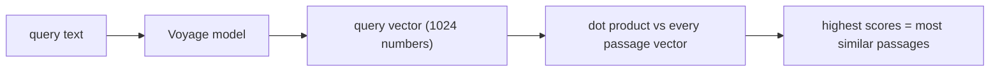

# Module 5 — Search engine part 1: embeddings & query understanding

**Goal:** understand the AI half of search — what an embedding *is*, how this app stores and serves 52,869 of them inside a 512 MB box, how a query is turned into something searchable, and how the whole thing is kept cheap. This is the most resume-relevant module: "I built and operate a hybrid semantic search system with cost controls" is a strong sentence, and after this you'll be able to back it up.

Files: `backend/app.py` (`:164-451`), `embed_passages.py`, `utils.py`, `query_parsing.py`, `scripture_parse.py`, `search_cache.py`, `telemetry.py`.

---

## 1. What is an embedding? (the one concept to nail)

An **embedding** is a list of numbers (a vector) that represents the *meaning* of a piece of text. A model (here, Voyage AI's `voyage-3`) reads a passage and outputs ~1024 numbers. The magic property: **texts with similar meaning produce vectors that point in similar directions**, even if they share no words.

So "the Lord's Supper" and "the Eucharist" land near each other in this 1024-dimensional space, while "tax law" lands far away. That's what lets semantic search find relevant passages that a keyword search would miss.

To measure "similar direction" you use **cosine similarity** — the cosine of the angle between two vectors. It ranges from -1 (opposite) to 1 (identical direction). If you first **normalize** every vector to length 1 (a "unit vector"), cosine similarity becomes just the **dot product** (multiply matching components, sum them). That simplification is why this code normalizes everything up front — scoring then reduces to one fast matrix multiply.



**RAG connection:** this "embed the query, find nearest passages" step is the *retrieval* in Retrieval-Augmented Generation. This app stops at retrieval (it shows you the passages). The disabled synthesis feature would feed those passages to Claude to write a summary — that's the "augmented generation" part. Owning the retrieval half is owning the hard, durable part of RAG.

## 2. Creating the embeddings — `embed_passages.py` (offline)

Embeddings are produced **once, offline**, and stored in the database. This script is the producer; the server is the consumer. It's a textbook batch job, and several details are worth absorbing because they recur in every data pipeline.

The table (`embed_passages.py:69`):

```python
CREATE TABLE IF NOT EXISTS embeddings (
    passage_id INTEGER PRIMARY KEY,
    vector BLOB
)
```

One vector per passage, stored as a **BLOB** (raw bytes). The bytes are float32 numbers packed with `struct.pack(f"{len(vec)}f", *vec)` (`:130`) — i.e. 4 bytes per number. (The matching unpacker is `utils.unpack_vector` at `utils.py:96`.)

The qualities that make this a *good* batch job:

- **Idempotent + resumable** (`:77`): it only selects passages with no embedding row yet (`LEFT JOIN embeddings ... WHERE embeddings.passage_id IS NULL`) and commits after every batch (`:135`). Crash halfway through 53k passages? Re-run and it picks up where it left off, never re-paying for vectors it already has. (Embeddings cost money, so "never redo work" is also "never re-spend.")
- **Token-budgeted batching** (`:98-122`): Voyage caps *total tokens per request*, not just count. So a fixed batch of 128 *long* passages would overflow. The loop greedily packs each request up to `MAX_BATCH_TOKENS` (100k) or `MAX_BATCH_TEXTS` (128), whichever comes first. This is the kind of real constraint you only discover by reading an API's limits.
- **Oversized-input guard** (`:110`): a few "passages" are entire treatises (hundreds of thousands of tokens). It truncates each to `PER_INPUT_CHARS` so they embed on their opening text instead of erroring.
- **`input_type="document"`** (`:128`): Voyage supports *asymmetric* embeddings — passages are embedded as `"document"`, queries as `"query"` (you'll see the query side use `"query"` in section 4). Using the matching pair improves retrieval quality. They must agree, which is why both sides pin the same `VOYAGE_MODEL`.

## 3. Loading 52,869 vectors into a small instance — the float16 trick (`app.py:164`)

This is the single most impressive piece of engineering in the backend and a guaranteed interview highlight. The problem: at startup the server loads *every* passage vector into RAM so it can score queries fast. 52,869 vectors × 1024 dims × 4 bytes (float32) ≈ **217 MB** just for the matrix — and a naive load would briefly hold ~3× that (the raw bytes, a joined copy, and the final array). This optimization was originally written to fit the **512 MB** Render free plan; it still matters, keeping the container's footprint small on the current App Runner instance (1 vCPU / 2 GB) and cheap to run — it is part of why that instance could be halved from 2 vCPU / 4 GB without the corpus outgrowing it.

Two optimizations in `_load_embeddings()`:

**(a) Store as float16, not float32.** Half the bytes per number → ~108 MB instead of 217 MB. The precision loss (≈3-4 significant digits instead of 7) is immaterial for top-k ranking — you're sorting passages, not doing physics.

**(b) Stream and fill a preallocated matrix in place** so you never hold multiple full copies:

```python
vecs = np.empty((n, dim), dtype=np.float16)        # allocate the final matrix ONCE
...
while True:
    chunk = cursor.fetchmany(4096)                  # read 4096 rows at a time
    if not chunk: break
    ...
    arr = np.frombuffer(b"".join(blobs), dtype=np.float32).reshape(len(blobs), dim).copy()
    norms = np.linalg.norm(arr, axis=1, keepdims=True)  # length of each vector
    np.maximum(norms, 1e-10, out=norms)             # avoid divide-by-zero
    arr /= norms                                    # normalize to unit length (in float32)
    vecs[i:i+len(blobs)] = arr                      # assign -> cast down to float16 here
    i += len(blobs)
```

Read the comment trail at `:164-179` — it explains the whole strategy. The key moves: normalize each chunk while it's still float32 (precise), then *cast down to float16 only on assignment* into `vecs`. At no point do you hold a second full float32 copy of the matrix. Peak memory ≈ 1× the final matrix.

The module-level line `PASSAGE_IDS, PASSAGE_VECS, PASSAGE_ID_TO_IDX = _load_embeddings()` (`:299`) runs this **once at import**, so the matrix is shared by all 8 gunicorn threads (read-only data, no per-request cost). If there are no embeddings, it returns an empty matrix and search degrades to keyword-only — never crashes.

## 4. Scoring a query against the matrix (`app.py:236`, `:320`, `:354`)

Three layered functions:

**`_embed_query_vector(query)`** (`:320`) turns the query text into a unit vector:

```python
key = _cache_key(query)
cached = embed_cache.get(key)
if cached is not None:
    return cached                       # 1. served from cache -> no API call, no cost
if not budget_remaining():
    return None                         # 2. monthly budget spent -> skip the paid call
result = voyage_client.embed([query], model=VOYAGE_MODEL, input_type="query")  # 3. the paid call
record_spend("voyage_embed")
vec = np.array(result.embeddings[0], dtype=np.float32)
vec = vec / np.linalg.norm(vec)         # normalize so dot product == cosine
embed_cache.set(key, vec)
return vec
```

Notice the order: **cache → budget → API**. The cheapest paths are tried first, and the expensive external call only happens if both gates pass. Every external call is wrapped in try/except: a Voyage failure logs and returns `None`, which the caller treats as "no vector results" and falls back to keyword search. **An AI provider hiccup never 500s the request.**

**`_cosine_scores(vecs, query_vec)`** (`:236`) does the actual similarity math without inflating memory:

```python
if vecs.dtype == np.float32:
    return vecs @ query_vec             # simple case
# float16 store: score in float32 row-chunks of 8192 rows
out = np.empty(n, dtype=np.float32)
for s in range(0, n, 8192):
    out[s:s+8192] = vecs[s:s+8192].astype(np.float32) @ qf
```

If it just wrote `PASSAGE_VECS @ query_vec`, numpy would upcast the *entire* float16 matrix to a float32 copy (217 MB) for that one multiply — defeating the float16 savings. Instead it converts 8192-row slices at a time. This is the float16 trick's necessary partner: store small *and* score small.

**`vector_search(query, limit, allowed_ids)`** (`:354`) ties it together: embed the query, score all (or an author-filtered subset of) passages, return the top `limit`. The top-k is done with `_top_k_indices` (`:308`), which uses `np.argpartition` — an O(n) partial sort that finds the top 100 without fully sorting all 52,869 scores. Small optimization, correct instinct.

## 5. The keyword side — `fts_search` (`app.py:379`) and FTS safety

The keyword signal queries the FTS5 index from Module 3:

```python
SELECT passages.id, bm25(passages_fts) AS score
FROM passages_fts JOIN passages ON passages.id = passages_fts.rowid
WHERE passages_fts MATCH ?
ORDER BY score
```

`bm25(passages_fts)` is the relevance score (lower is better in SQLite's BM25). The crucial safety detail is what gets bound to `MATCH ?` — it comes from `prepare_fts_query` in `query_parsing.py:16`:

```python
tokens = re.findall(r"[\w']+", q, flags=re.UNICODE)
return " ".join('"' + t.replace('"', '""') + '"' for t in tokens)
```

This is **FTS injection defense**. FTS5's `MATCH` has its own query syntax (`AND`, `OR`, `NEAR`, `*`, `:`, etc.). If you passed raw user input, a user could type operators that change the query's meaning or make it error. So the code extracts plain word tokens, wraps each in quotes (so punctuation is treated as a literal, not an operator), and escapes embedded quotes by doubling them. The result is a `MATCH` expression that can only ever be "these literal words," never an operator injection. This is the FTS analog of parameterized SQL — and note the *values* are still bound with `?` too, so there are two layers.

## 6. Understanding the query — author detection without an LLM (`query_parsing.py`)

A query like "what did Augustine teach about grace" has two parts: an **author** (Augustine) and a **topic** (grace). Detecting the author is a lookup problem, not a reasoning problem, so the code does it **locally and for free**, reserving the LLM for topic extraction. The history comment at `:28` is instructive: they *used* to ship all ~250 author names to the LLM on every call, and that roster dominated token cost. Moving author detection local was a real cost optimization.

- **`_build_author_token_index`** (`:50`) maps each distinctive name token to its *sole* real author. Tokens shared by several Fathers (`gregory`, `john`, `cyril`) are deliberately left out, so a bare ambiguous name never silently picks one. A `Pseudo-X` entry doesn't block the real `X`. This index is built once at startup.
- **`detect_author_local`** (`:69`) is **precision-first**: a full canonical name appearing in the query wins; otherwise a single unambiguous token. It returns the canonical DB name or `None`. Sorting candidate names by length descending (`:83`) means "Gregory of Nyssa" matches before bare "Gregory."
- **`strip_author_tokens`** (`:93`) removes the author's words, leaving the topic — so the keyword search isn't polluted by the author's name.
- **`resolve_author_name`** (`:102`) maps whatever string the *LLM* returns back to a canonical DB name (exact match, then substring), tolerating the LLM shortening or misspelling a name.

This division of labor — deterministic local code for the lookup, LLM only for the fuzzy topic — is exactly how you should think about using LLMs as a component: **don't pay a model to do what a dictionary can do.**

## 7. Short-circuiting scripture references — `scripture_parse.py`

Before any of the expensive machinery runs, the search route checks whether the query is just a scripture reference like "Romans 8" or "Matthew 5:3". `parse_scripture_ref` (`:31`) matches it with a regex and returns `{book, chapter, verse, ref}` or `None`. If it's a reference, the route answers straight from the `scripture_index` table — **no LLM, no embedding, no cost, instant**. This file also holds `BIBLE_BOOK_ORDER` (`:47`) and `book_sort_key` (`:64`), which sort the scripture browser into canonical biblical order (Genesis first, Revelation last) instead of alphabetical — books not in the list sort to the end. `effective_section` (`:69`) decides a work's display collection (explicit section, else "Commentary" for `Commentary on …` titles, else "Miscellaneous").

## 8. Text cleaning — `utils.py`

The corpus is scraped HTML with footnote markup and inline scripture citations. `utils.py` produces clean plain text for search and snippets:

- **`strip_html`** (`:84`) → BeautifulSoup to plain text, with a fast path that skips parsing when there's no `<` in the string (most cleaned strings).
- **`remove_scripture_refs`** (`:68`) strips CCEL footnote spans (`class="fn"/"ref"/"stiki"`) and inline citations like "Matthew 8:22" via the big `SCRIPTURE_REF_RE` regex (`:42`), which enumerates Bible book names. Why remove them? Because a passage *about* grace shouldn't rank for "8:22" just because it cites a verse — the citations are noise for the topic search.
- **`unpack_vector`** (`:96`) decodes the float32 BLOBs (the read counterpart to `embed_passages.py`'s pack).

## 9. Caching — `search_cache.py`

Caching is what makes the whole thing affordable. The module defines a `TTLCache` and four instances:

```python
embed_cache  = TTLCache(EMBED_CACHE_SIZE,  CACHE_TTL_SEC, "embed")   # query vectors (RAM-heavy)
parse_cache  = TTLCache(PARSE_CACHE_SIZE,  CACHE_TTL_SEC, "parse")   # gates the Gemini call
hybrid_cache = TTLCache(HYBRID_CACHE_SIZE, CACHE_TTL_SEC, "hybrid")  # final ranked id lists
fts_cache    = TTLCache(FTS_CACHE_SIZE,    CACHE_TTL_SEC, "fts")     # keyword hit lists
```

`TTLCache` (`:30`) is a **thread-safe LRU cache with per-entry TTL**:

- **LRU (Least Recently Used)**: backed by an `OrderedDict`; on every `get`/`set` the key is `move_to_end`-ed, and when the cache exceeds `maxsize` it evicts the oldest (`popitem(last=False)`). So hot queries stay, cold ones fall out.
- **TTL (Time To Live)**: each entry stores an expiry timestamp; a `get` past expiry deletes it and returns a miss. Default TTL is **30 days** (`CACHE_TTL_SEC = 2592000`) — the corpus is static, so a query's answer is valid for a long time.
- **Thread-safe**: every mutation is under a `Lock`, because gunicorn's 8 threads share these caches. Without the lock, two threads mutating the `OrderedDict` at once could corrupt it.

The two *paid* gates (`embed_cache`, `parse_cache`) are what protect the budget: a query repeated within 30 days makes **zero** API calls. `embed_cache` is sized smaller because each entry is a ~4 KB vector (RAM-heavy); the others hold tiny dicts/id-lists. All sizes are env-tunable.

## 10. Cost control & observability — `telemetry.py`

Two responsibilities, both about operating an AI feature responsibly.

**(a) The monthly budget cap.** A Redis counter, one key per calendar month (`_period_key` → `aetc:spend:2026-06`, `:53`):

- `record_spend(call_type)` (`:87`) increments the month's counter by an approximate per-call cost (`COST_PER_CALL_USD`, `:36` — pessimistic so the cap trips slightly early). Uses a Redis pipeline to increment-and-set-expiry atomically; expiry ~40 days so the counter outlives its month.
- `budget_remaining()` (`:58`) returns whether spend is still under `MONTHLY_BUDGET_USD` ($10 default). The paid paths call this *before* spending (you saw it in `_embed_query_vector`).
- **The "fail open" decision** (`:58-71`): if Redis is unreachable, `budget_remaining()` returns `True` (allow the call). The reasoning: "we'd rather serve a query than 500 because the spend counter is down." The documented flip side — **the cap is only enforced when Redis is configured** — is the single most important caveat to be able to state. Without Redis, caching is the only thing bounding spend.
- `budget_status()` (`:74`) feeds `/api/health` so you can see whether the cap is actually live (`enabled`) and how much is spent.

**(b) Structured logging.** `log_ai_call` (`:104`) emits one **JSON line** per AI call (provider, model, latency_ms, ok, error). JSON logs are greppable/queryable in any log backend (App Runner streams application logs to CloudWatch Logs) — so you can answer "what's our p95 Voyage latency?" or "what's our error rate?" from logs alone. Logging *structured* events instead of free-text strings is a small habit with big operational payoff.

## 11. Putting part 1 together

You now have all the pieces the search route assembles in Module 6:

- a **vector** signal (`vector_search`) — semantic, paid, cached, budget-gated
- a **keyword** signal (`fts_search`) — exact, free, injection-safe
- a **title** signal (`title_match_search`, seen briefly at `app.py:432`)
- **author detection** (local) and **topic extraction** (LLM, Module 6)
- a **scripture short-circuit** that bypasses all of it
- **caches** and a **budget guard** wrapping the paid calls

## 12. Check yourself

1. In one sentence: what is an embedding, and why does cosine similarity find "Eucharist" when you search "Lord's Supper"?
2. Two tricks let 52,869 vectors fit in 512 MB. Name both and explain why `_cosine_scores` must score in float32 *chunks* rather than one big multiply.
3. Why is author detection done locally instead of by the LLM? What changed to make that a cost win?
4. What is "FTS injection" and how does `prepare_fts_query` prevent it?
5. The budget cap "fails open." What does that mean, what's the risk, and what single piece of infrastructure makes the cap real?
6. Why does the embedding *batch* job pin the same model and `input_type` as the query path?

Next: [Module 6 — Search engine part 2: hybrid ranking](06-search-ranking.md).
