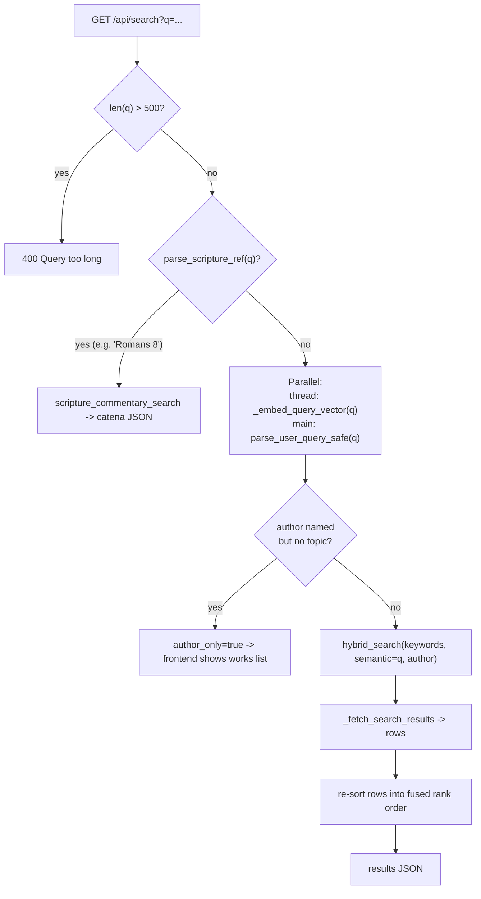
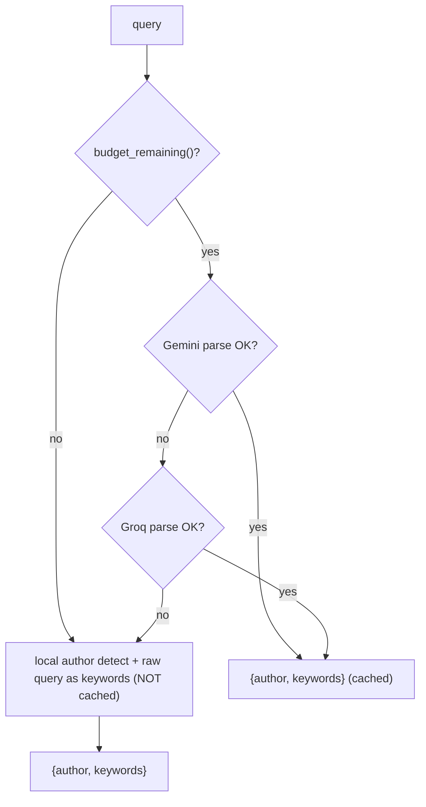

# Module 6 — Search engine part 2: hybrid ranking

**Goal:** assemble the pieces from Module 5 into the actual `/api/search` request. By the end you can explain reciprocal rank fusion, why three signals beat one, how the LLM is used (and how it gracefully fails), and the parallelism trick that halves latency.

Files: `backend/app.py` (`:432-975`), `backend/ranking.py`.

---

## 1. The big picture of one search



## 2. The route, top to bottom — `app.py:855`

```python
@app.route("/api/search")
@limiter.limit("10 per minute", override_defaults=True)
def search():
    q = request.args.get("q", "").strip()
    if len(q) > MAX_QUERY_LENGTH:                 # 500-char cap
        return jsonify({"error": "Query too long"}), 400
    if not q:
        return jsonify({... "results": []})       # empty query -> empty result, no work
```

Two guards first: the **rate limit** decorator (10/min — this is the expensive endpoint) and the **500-char cap**. The cap is a cost-and-abuse control: it bounds the size of any single LLM/embedding call (you can't make the app embed a megabyte of text).

### Step A — scripture short-circuit (`:878`)

```python
ref = parse_scripture_ref(q)
if ref:
    rows = scripture_commentary_search(ref)
    if rows:
        results = [{...} for row in rows]
        return jsonify({... "scripture_ref": ref["ref"], "results": results})
```

If the query is "Romans 8", this returns a catena (every Father's commentary on that verse/chapter) straight from the database — **no LLM, no embedding, no cost**. `scripture_commentary_search` (defined at `app.py:73`) is the verse-matching query: an exact verse matches the verse and ranges starting at it (`5:3` matches `5:3` and `5:3-4` but not `5:30`), a chapter-only query matches everything in the chapter. Notice the `if rows:` — if a reference has no commentary, it *falls through* to normal search rather than returning empty.

### Step B — the parallelism trick (`:910`)

This is a standout latency optimization. Read the comment block at `:901` — it's a clinic.

```python
with ThreadPoolExecutor(max_workers=1) as _ex:
    _embed_future = _ex.submit(_embed_query_vector, q)   # start embedding in a thread
    parsed = parse_user_query_safe(q, AUTHOR_NAMES)      # parse on the main thread, meanwhile
    _embed_future.result()                                # wait for the embed to finish
```

The insight: the Voyage **embedding depends only on the raw query `q`**, not on the Gemini parse result. So there's no reason to wait for the parse before starting the embed. Both are slow network round-trips. Running them back-to-back costs `parse_time + embed_time`; running them concurrently costs `max(parse_time, embed_time)` — roughly half.

The mechanism: submit the embed to a worker thread, do the parse on the main thread at the same time, then `.result()` to join. When `hybrid_search` later calls `vector_search → _embed_query_vector(q)`, the answer is already sitting in `embed_cache` (warm), so it returns instantly instead of making a second call. This works because the AI clients are thread-safe and `embed_cache` is keyed on the query string. The honest trade-off is noted too: an author-only query doesn't actually need the embed, so this spends one speculative Voyage call in that case (cheap, and cached).

### Step C — author-only shortcut (`:922`)

```python
author = resolve_author_name(parsed.get("author", "none"), AUTHOR_NAMES)
keywords = ... # cleaned, "none"/"n/a" -> ""
if author and not keywords:
    author_id = get_author_id_by_name(author)
    return jsonify({... "author": author, "author_id": author_id, "author_only": True, "results": []})
```

If the query is just "Augustine" (an author, no topic), there's nothing to rank — the frontend should show Augustine's works list. So the route returns `author_only: true` with the author's id and *no* passage results. The frontend reads that flag and navigates accordingly (Module 8). This is a nice example of the API shaping the response to the user's intent rather than forcing one rigid result format.

### Step D — hybrid search (`:933`)

```python
search_text = keywords or q
passage_ids = hybrid_search(search_text, semantic_text=q, author=author)
```

Two different texts feed the two kinds of search, and **this is deliberate** (`:934`):

- **`semantic_text=q`** — the *full natural-language query* drives the vector/embedding signal. Embeddings read intent better from real phrasing ("what did Chrysostom teach about forgiveness") than from a few stripped words.
- **`search_text=keywords`** — the *extracted topic keywords* drive the exact-term signals (FTS, title). Keyword matching wants "forgiveness," not "what did teach about."

Using the right text for the right signal is a subtle quality win that most implementations miss.

## 3. The LLM parse — `parse_user_query` (`:582`) and the fallback chain

This is how the app *uses an LLM as a component*. The job is narrow: turn a query into `{author, keywords}`. The prompt (`_build_parse_system_prompt`, `:558`) ships the **full author roster** and asks for exactly two lines:

```
author: <exact name from the list, or none>
keywords: <topic words, or none>
```

Why send all ~250 names? So the model can resolve a Father robustly — including **misspellings, partial names, and ambiguous first names** that local detection deliberately refuses to guess. The LLM is doing the *fuzzy* matching that a dictionary can't.

Key call details (`:596`):

```python
response = gemini_client.models.generate_content(
    model="gemini-2.5-flash-lite",
    contents=f"User search query: {raw_query}",
    config=...(
        system_instruction=PARSE_SYSTEM_PROMPT,
        max_output_tokens=60,                       # the answer is two short lines
        thinking_config=ThinkingConfig(thinking_budget=0),  # no chain-of-thought
    ),
)
```

- A **tiny, cheap model** (`flash-lite`) — this is extraction, not reasoning.
- **`max_output_tokens=60`** caps output cost; the answer is two lines.
- **`thinking_budget=0`** turns off the model's internal reasoning tokens. For pure extraction you don't want it "thinking" — and worse, reasoning tokens could eat the 60-token budget and leave no room for the actual answer (returning empty text). Knowing this failure mode is real production experience.

### The three-layer fallback (the resilience story)



- **`parse_user_query`** (`:582`) tries **Gemini** first; on *any* exception it logs and falls to **Groq** (Llama 3.3 70B, free tier) with the same prompt (`:617`). If both fail, it raises.
- **`parse_user_query_safe`** (`:649`) wraps that with the budget gate and the *local* fallback:
  - cache hit → return (free).
  - budget remaining → try the LLM; on success, **cache it**; on failure, fall through.
  - budget spent or LLM failed → use `detect_author_local` + the raw query as keywords. This is **still useful**: a clearly-named author still routes to their works, and the raw query still drives FTS. It's just not as smart at fuzzy names.
  - The degraded result is **deliberately not cached** (`:657`), so once the budget resets on the 1st, the next run gets a fresh, smarter LLM parse instead of being pinned to the degraded answer.

This is the graceful-degradation theme made concrete: **three quality tiers (Gemini → Groq → local), and the app keeps working at every tier.** Search never returns a 500 because an AI provider is down or the budget is spent.

## 4. Reciprocal Rank Fusion — `ranking.py`

Now the heart of "hybrid." `hybrid_search` (`app.py:478`) gathers three ranked lists and fuses them:

```python
pool = limit * 3                                              # pull a deeper candidate pool
vector_hits = vector_search(semantic_text, limit=pool, allowed_ids=allowed_ids)  # meaning
fts_hits    = fts_search(lexical_text, limit=pool, author=author)                # exact terms
title_hits  = title_match_search(lexical_text, limit=50, author=author)          # whole treatises

fused = {}
rrf_accumulate(fused, vector_hits, weight=RRF_WEIGHT_VECTOR)   # 1.3
rrf_accumulate(fused, fts_hits,    weight=RRF_WEIGHT_FTS)      # 1.0
rrf_accumulate(fused, title_hits,  weight=RRF_WEIGHT_TITLE)    # 0.5
ranked = [pid for pid, _ in sorted(fused.items(), key=lambda kv: kv[1], reverse=True)]
passage_ids = diversify(ranked, PASSAGE_WORK_INDEX, PASSAGE_AUTHOR_INDEX, limit=limit)
```

### Why you can't just add the raw scores

The three signals are on **incompatible scales**: vector cosine is 0-1 (higher better), FTS BM25 is an unbounded score where *lower* is better, title BM25 is something else again. Averaging them directly is meaningless. You'd have to normalize each to a common scale, which is fiddly and fragile.

### RRF's trick: use *rank*, not *score* (`ranking.py:26`)

```python
def rrf_accumulate(fused, hits, weight=1.0, k=60):
    for rank, (pid, _score) in enumerate(hits):
        fused[pid] = fused.get(pid, 0.0) + weight / (k + rank + 1)
```

Reciprocal Rank Fusion throws away the raw scores and uses only each item's **position** in each list. A passage ranked #1 in a list contributes `weight / (k + 1)`, #2 contributes `weight / (k + 2)`, and so on — a quickly-decaying contribution. A passage's final score is the **sum of these contributions across all three lists**. So a passage that shows up high in *multiple* signals rises to the top, and a passage that's #1 in one signal but absent from the others can still rank well.

- **Scale-free**: because it only uses rank, cosine and BM25 and title scores fuse without any normalization. That's the whole appeal — it's robust and almost parameter-free.
- **`k=60`** is the standard RRF constant; it softens the gap between the top ranks (without it, #1 would dominate #2 far too much).
- **`weight`** is the per-signal tuning knob. The chosen weights (`ranking.py:12`) — vector 1.3, FTS 1.0, title 0.5 — encode a philosophy: lead with *meaning*, keep exact-term precision, and let title matches gently nudge whole treatises up without dominating. The comments even tell you how to tune ("raise VECTOR if results feel too literal, raise FTS if too fuzzy").

This is genuinely the technique production search systems use to combine signals. Being able to explain "we fuse three retrieval signals with reciprocal rank fusion, which is scale-free so we don't have to normalize incompatible score ranges" is a strong interview moment.

### The third signal — `title_match_search` (`app.py:432`)

Why a *title* signal at all? Because some substantive works (Tertullian's *On Baptism*) are stored as one giant passage, so BM25 *buries* them (long documents score poorly, and one passage can't dominate). Matching the query against the **work title** resurfaces these. It excludes `Commentary on …` titles (`:455`) so book-name titles don't over-match — those are already well covered by FTS.

### Diversification — `diversify` (`ranking.py:37`)

```python
DIVERSITY_CAP_PER_WORK = 3
DIVERSITY_CAP_PER_AUTHOR = 6
```

After fusion you might have 10 near-identical snippets from one prolific commentary. That reads badly. `diversify` walks the ranked list and **caps** how many passages any single work (3) or author (6) may contribute, skipping over-quota hits while preserving rank order. The author cap is looser because one Father can legitimately own several relevant works. This is why `hybrid_search` pulls a `pool = limit * 3` deeper candidate set (`:494`) — so there's room to skip duplicates without starving the final count.

`ranking.py` is **pure Python** — no DB, no Flask, no embeddings, just lists and dicts in and a ranked list out. That makes it trivially unit-testable (and indeed it is tested, Module 11). Keeping ranking logic pure is a deliberate, testable-by-design choice.

### The writing floor — when good ranking still reads badly

Here is a failure that no amount of weight-tuning fixes. Search "hardship" and every result is a Bible commentary. The instinct is to blame the ranking. It isn't the ranking: **94% of the corpus is verse-keyed commentary** — 49,757 passages against 3,113 standalone writings. Writings don't rank badly; there are sixteen times fewer of them, so a rank-ordered page almost never contains one.

That's a *distribution* problem, and it needs a distribution-shaped fix:

```python
DIVERSITY_WRITING_FLOOR = 2
DIVERSITY_WRITING_WINDOW = 15
```

Three details are worth stealing:

- **The floor applies to page one, not the result list.** The first version measured across all 100 returned ids and did nothing — it was "satisfied" by a writing at rank 80 that no reader ever scrolls to. A floor has to be scoped to what is actually *seen*.
- **It fills from the bottom.** Slots are taken from the weakest end of the page, so the reader's top hits are untouched. The change lands exactly where a tenth near-duplicate commentary snippet was worth less than the first treatise on the subject.
- **It exchanges, never drops.** When the promoted writing was already on the list, the displaced result takes its old place, so the output is a permutation of the input. Losing a hit outright would be a worse bug than the skew it fixes.

And it's a floor, not a quota: it does nothing when the ranking already surfaced enough writings, and nothing when none matched. A quota would degrade good results to satisfy a rule; a floor only fires when the page would otherwise hide a whole category from the reader.

The kind itself is never stored. A passage is a "writing" iff it has no `scripture_index` row, derived once at boot into a set of 3,113 ids (~125 KB). Adding a column would have meant rebuilding and re-uploading a 633 MB database for information the schema already implied.

## 5. Fetching and final ordering — `_fetch_search_results` (`:680`)

`hybrid_search` returns only passage **ids** in rank order. `_fetch_search_results` loads the actual rows (text, author, work, header, tradition) with a single `WHERE passages.id IN (...)` query. But SQL `IN` doesn't preserve order, so the route re-imposes the fused ranking (`:964`):

```python
rank = {pid: i for i, pid in enumerate(passage_ids)}
passages.sort(key=lambda p: rank[p["id"]])
```

It builds a `pid → position` map and sorts the fetched rows back into rank order. A classic pattern: **rank with ids (cheap), hydrate with one bulk query, then re-sort to the ranked order.** The DB error path returns `503 Search temporarily unavailable` (`:950`) rather than 500 — a database hiccup is "try again," not "server bug."

## 6. The response shape

Every search response has the same envelope, so the frontend can branch on it:

```json
{
  "query": "...",
  "keywords": "grace",
  "author": "Augustine of Hippo" | null,
  "author_id": 42 | null,
  "author_only": false,          // true -> show works list, not results
  "scripture_ref": "Romans 8" | null,  // non-null -> this was a catena
  "results": [ { id, passage, author, work, work_id, header, tradition }, ... ]
}
```

`author_only` and `scripture_ref` are the two flags that tell the frontend "this isn't a normal results page" — render the author's works, or render a catena. Designing one consistent envelope with mode flags (instead of three different endpoints) keeps the client simple.

## 7. Check yourself

1. Why are the embedding and the Gemini parse run in parallel? What property of the embedding makes that safe?
2. Explain reciprocal rank fusion to someone who knows search. Why does it let you combine cosine similarity and BM25 without normalizing them?
3. The vector signal gets the *full query* but the keyword signals get the *stripped keywords*. Why the difference?
4. Walk the LLM fallback chain. At each tier, what still works and what's lost?
5. Why does the route pull `limit * 3` candidates before diversifying?
6. Why re-sort the fetched rows in Python instead of trusting the order of the `IN (...)` query?

Next: [Module 7 — Remaining backend endpoints](07-backend-endpoints.md).
