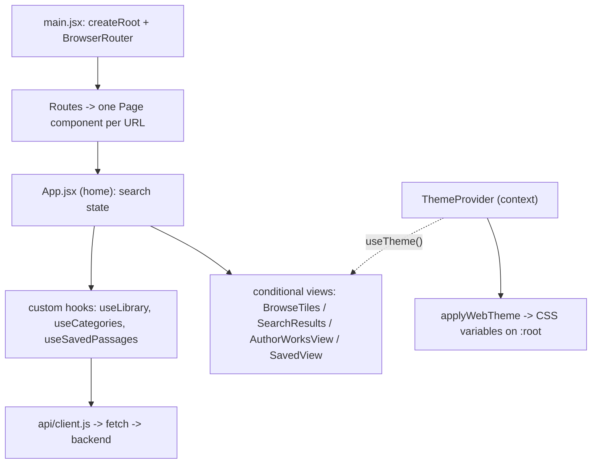

# Module 8 — Frontend foundation

**Goal:** understand how the React app boots, routes between pages, manages state, talks to the API, and shares logic through custom hooks. If your backend experience is stronger, this is the module that makes you genuinely fullstack — the patterns here (component tree, hooks, controlled inputs, effects, cleanup) are 80% of day-to-day React.

Files: `src/main.jsx`, `src/App.jsx`, `src/api/client.js` (Module 2), `src/theme/*`, `src/hooks/*`.

---

## 1. React in one paragraph (so the rest makes sense)

React builds UI from **components** — functions that return markup (JSX). A component re-runs ("re-renders") whenever its **state** or **props** change, and React efficiently updates only the DOM that actually changed. **State** is data a component owns (`useState`). **Props** are data passed down from a parent. **Hooks** (`useState`, `useEffect`, `useRef`, custom `useX`) are how function components hold state and run side effects. That's the whole model: state changes → re-render → DOM updates. Everything below is an application of it.

## 2. The entry point — `src/main.jsx`

This is where the app attaches to the page. Three things happen:

**(a) Theme applied before React mounts** (`:19`):

```js
const stored = localStorage.getItem(COLOR_MODE_KEY)
const initialMode = stored === 'dark' ? 'dark' : 'light'
applyWebTheme(initialMode)
```

Reading the saved theme and applying it *before* React renders avoids a "flash of wrong theme" (white flash before dark mode kicks in). (`public/theme-init.js` does an even-earlier version of this inline — Module 11.)

**(b) Manual scroll restoration** (`:25`):

```js
if ('scrollRestoration' in window.history) {
  window.history.scrollRestoration = 'manual'
}
```

The browser normally restores scroll position on Back. But this app loads content *asynchronously*, so the browser would restore scroll before the content exists and land in the wrong place. Turning it `manual` lets the app restore scroll itself once data arrives (`useScrollRestoration`).

**(c) Mount + routing** (`:29`):

```jsx
ReactDOM.createRoot(document.getElementById('root')).render(
  <React.StrictMode>
    <ThemeProvider>
      <BrowserRouter>
        <SeoJsonLd />
        <Routes>
          <Route path="/" element={<App />} />
          <Route path="/read/:workId" element={<ReadPage />} />
          <Route path="/browse/:slug" element={<BrowsePage />} />
          <Route path="/scripture/:book/:chapter/:verse" element={<ScripturePage />} />
          <Route path="/topics/:slug" element={<TopicPage />} />
          ...
        </Routes>
      </BrowserRouter>
    </ThemeProvider>
  </React.StrictMode>,
)
```

This is the app's skeleton:

- **`createRoot(...).render(...)`** attaches React to the `<div id="root">` in `index.html`.
- **`<React.StrictMode>`** is a dev-only wrapper that intentionally double-invokes effects to surface bugs (like missing cleanup). It does nothing in production.
- **`<BrowserRouter>` + `<Routes>` + `<Route>`** is **client-side routing**. Instead of the server returning a new HTML page per URL, React swaps components in the browser. `:workId`, `:slug`, etc. are **URL parameters** the page reads via `useParams`. This is the "SPA" model — and it's why the server needs the `index.html` fallback (Module 7) and the CDN needs an equivalent (CloudFront custom error responses in production; Netlify's `_redirects` previously — Module 11): a hard refresh on `/read/123` must still serve the app.
- **Provider nesting**: `<ThemeProvider>` wraps everything so any component can read the theme via context (section 6).

## 3. `App.jsx` — the home page and search controller

`App.jsx` is the biggest, most stateful component. It owns the search experience. Its job: hold search state, call the API, and decide which of several views to show.

### The state (`:34`)

```jsx
const [query,        setQuery]        = useState('')      // text in the search box
const [results,      setResults]      = useState([])      // passage results
const [searched,     setSearched]     = useState(false)   // has a search happened?
const [searching,    setSearching]    = useState(false)   // is a search in flight?
const [view,         setView]         = useState('search')// 'search' | 'saved'
const [authorFilter, setAuthorFilter] = useState(null)
const [authorWorks,  setAuthorWorks]  = useState(null)    // author-only result
const [scriptureRef, setScriptureRef] = useState(null)    // catena marker
const [searchError,  setSearchError]  = useState(null)
```

Each `useState` returns `[value, setter]`. Calling a setter triggers a re-render. Notice how the state mirrors the API's response envelope from Module 6 (`author_only`, `scripture_ref`, `keywords`) — the frontend state is shaped by what the backend can return. The data shared with *other* pages (saved passages, library, categories) is pulled out into custom hooks (`useSavedPassages`, `useLibrary`, `useCategories`) so it isn't duplicated.

### `doSearch` — the core async handler (`:147`)

This function is a great study in robust client-side data fetching. Walk it:

```jsx
async function doSearch(q, searchOverride = undefined) {
  if (!q || !q.trim()) return
  const apiQuery = (searchOverride ?? q).trim()

  searchController.current?.abort()              // 1. cancel any in-flight search
  const controller = new AbortController()
  searchController.current = controller
  const opts = { signal: controller.signal }

  setQuery(q); setSearching(true); setSearched(true); setView('search'); ...

  try {
    const data = await api.search(apiQuery, opts)
    if (data.author_only && data.author_id) {    // 2. branch on the response mode
      const worksData = await api.authorWorks(data.author_id, opts)
      setAuthorWorks({ id: data.author_id, name: worksData.name, works: worksData.works || [] })
      setResults([])
      return
    }
    setAuthorFilter(data.author || null)
    setTopicQuery(data.keywords || q)
    setScriptureRef(data.scripture_ref || null)
    setResults(data.results || [])
  } catch (err) {
    if (isAbortError(err)) return                // 3. ignore cancellations silently
    if (err instanceof ApiError && err.body?.error) setSearchError(err.body.error)
    setResults([])
  } finally {
    if (searchController.current === controller) { // 4. only the latest search clears the spinner
      setSearching(false)
      searchController.current = null
    }
  }
}
```

Four production-grade details:

1. **AbortController / request cancellation.** Each new search aborts the previous one via `searchController.current?.abort()`. If you type fast and fire three searches, the first two are cancelled so a slow earlier response can't overwrite a newer one (the classic "race condition" where stale results win). The `AbortController` signal is threaded all the way down to `fetch` (Module 2).
2. **Branching on response mode.** It reads `data.author_only` and `data.scripture_ref` — the flags the backend set in Module 6 — to decide whether to show an author's works, a catena, or normal results. The API's response shape and the UI's view logic are two sides of the same contract.
3. **Distinguishing cancellation from real errors.** `isAbortError(err)` returns early (a cancelled request isn't a failure), while a real `ApiError` with a server message (like "Query too long") is surfaced to the user. Silent on cancel, loud on real failure.
4. **The "is this still the latest?" guard.** In `finally`, it only clears `searching` if `searchController.current === controller` — i.e. this is still the most recent search. Without it, a late-resolving aborted request could turn off the spinner for a newer in-flight one.

This is exactly how you should fetch in a real app: cancellable, race-safe, error-aware. Most tutorials skip all of it.

### The view switch (`:311`)

The return JSX renders **one of several views** based on state, using conditional rendering (`{condition && <Component/>}`):

```jsx
{view === 'saved' && <SavedView ... />}
{view === 'search' && !searched && <BrowseTiles ... />}          // landing
{view === 'search' && searched && authorWorks && <AuthorWorksView ... />}
{view === 'search' && searched && !authorWorks && <SearchResults ... />}
```

So the same component shows the library landing, an author's works, search results, or the saved list — chosen by the state flags. Data and callbacks flow **down** as props (`results={results}`, `onToggleSave={toggleSave}`); events flow **up** by calling those callbacks. This one-way data flow (state at the top, props down, events up) is the core React mental model.

### Restore-on-back (`:68`, `:115`)

A nice UX touch: when you open a passage and hit Back, `ReadPage` passes `restoreQuery` via router **location state**, and `App.jsx`'s effects re-run the last search and scroll you back to the exact card you opened (`data-result-index`). This is why scroll restoration was set to `manual` in `main.jsx`. You don't need to master this on first read — just note that "preserve the user's place" took deliberate effort.

### The search input is *controlled* (`:293`)

```jsx
<input
  value={query}
  onChange={e => setQuery(e.target.value)}
  onKeyDown={e => e.key === 'Enter' && doSearch(query)}
/>
```

A **controlled component**: the input's value *is* React state (`query`), and every keystroke updates state via `onChange`. React is the single source of truth for what's in the box. This is the standard React form pattern.

## 4. Custom hooks — reusable stateful logic

A **custom hook** is just a function starting with `use` that calls other hooks. It lets you extract and reuse stateful behavior across components. This app has several clean examples.

### `useLibrary` (`hooks/useLibrary.js`) — fetch with retry + cleanup

```js
useEffect(() => {
  const controller = new AbortController()
  const load = (attempt = 0) => {
    api.library({ signal: controller.signal })
      .then(data => { setSections(data.sections || {}); setLoading(false) })
      .catch(err => {
        if (isAbortError(err)) return
        if (attempt < 4) { setTimeout(() => load(attempt + 1), 2000); return }  // retry
        setError(true); setLoading(false)
      })
  }
  load()
  return () => controller.abort()    // cleanup: abort if the component unmounts
}, [])
```

Three patterns to internalize:

- **`useEffect(() => {...}, [])`** runs once after first render (empty dependency array = "on mount"). This is where you do data fetching.
- **Retry with backoff** (`if (attempt < 4) setTimeout(load(attempt+1), 2000)`). Why? The backend cold-starts by loading the embedding matrix into RAM (~10-15s) whenever App Runner spins up a fresh instance (a new deploy, or scaling from idle). So the first `/api/library` call against a cold instance can fail or hang; the hook retries up to 4 times, 2s apart, before giving up. This is the client side of "the backend may be warming up" — graceful degradation on the frontend too.
- **Cleanup function** (`return () => controller.abort()`). The function an effect returns runs on unmount (or before the effect re-runs). Aborting the fetch prevents "set state on an unmounted component" warnings and wasted work. Returning `{ sections, loading, error }` gives consumers a clean loading/error/data tri-state.

`useCategories` (`hooks/useCategories.js`) is the same shape for `/api/categories`, reshaping the array into a `{category: {...}}` map for easy lookup.

### `useSavedPassages` (`hooks/useSavedPassages.js`) — state synced to localStorage

```js
const [saved, setSaved] = useState(readStored)         // lazy init: read localStorage once
useEffect(() => {
  localStorage.setItem(STORAGE_KEY, JSON.stringify(saved))  // persist on every change
}, [saved])
const toggleSave = useCallback((passageKey, result) => { ... }, [])
const isSaved = useCallback(key => saved.some(s => s.key === key), [saved])
```

This is "bookmarks" with **no backend** — saved passages live in the browser's `localStorage`. The pattern: initialize state *from* storage (`useState(readStored)` — passing a function means it runs lazily, once), and **write back to storage whenever the state changes** via an effect keyed on `[saved]`. `readStored` is defensively wrapped in try/catch (corrupt JSON → empty array) so a bad localStorage value can't crash the app.

`useCallback` memoizes the `toggleSave`/`isSaved` functions so they keep a stable identity across renders — important because they're passed as props to many children; without it, those children would see a "new" function every render and re-render needlessly.

> Resume note: the roadmap moves bookmarks to real accounts in the mobile app. Today's localStorage version is the right MVP — zero backend, instant, survives refresh — and the abstraction (`useSavedPassages`) means swapping to a server-backed store later only touches this one hook.

## 5. Other foundation hooks (briefly)

- **`usePageMeta`** (`hooks/usePageMeta.js`) — sets the document `<title>`, meta description, Open Graph / Twitter tags, and the canonical link for each route, then **restores defaults on unmount** (the effect's cleanup). Because this is an SPA, the `<title>` doesn't change on navigation unless something sets it — this hook is what gives each route proper SEO metadata. (More on SEO in Module 11.)
- **`useScrollRestoration` / `useScrollReveal`** — the first restores scroll position on Back (paired with the `manual` setting in `main.jsx`); the second adds the fade-in-on-scroll animations. Both are presentational polish.

## 6. The theme system — Context + CSS variables

Dark mode is implemented cleanly with two ideas: **React Context** for the current mode, and **CSS custom properties** for the actual colors.

### `ThemeProvider` (`theme/ThemeProvider.jsx`) — Context

```jsx
const ThemeContext = createContext(null)
export function ThemeProvider({ children }) {
  const [mode, setMode] = useState(readStoredMode)
  useEffect(() => {
    applyWebTheme(mode)                          // push colors to the DOM
    localStorage.setItem(COLOR_MODE_KEY, mode)   // remember the choice
  }, [mode])
  const toggle = useCallback(() => setMode(m => (m === 'light' ? 'dark' : 'light')), [])
  return <ThemeContext.Provider value={{ mode, toggle, isDark: mode === 'dark' }}>{children}</ThemeContext.Provider>
}
export function useTheme() {
  const ctx = useContext(ThemeContext)
  if (!ctx) throw new Error('useTheme must be used within ThemeProvider')
  return ctx
}
```

**Context** solves "prop drilling": instead of passing `mode` and `toggle` through every intermediate component, any descendant calls `useTheme()` to read them. The `ThemeToggle` button deep in the header calls `useTheme().toggle()` directly. The custom `useTheme` hook also throws a clear error if used outside the provider — a small DX nicety that turns a confusing `null` crash into an explanatory message.

### `applyWebTheme` (`theme/applyWebTheme.js`) — CSS variables

```js
export function applyWebTheme(mode = 'light') {
  const { colors, ... } = getThemeTokens(mode)
  const root = document.documentElement
  const map = { '--gold': colors.gold, '--bg': colors.bg, '--text': colors.text, ... }
  root.setAttribute('data-theme', mode)
  Object.entries(map).forEach(([key, value]) => root.style.setProperty(key, value))
  setMeta('theme-color', colors.chromeColor)   // even the browser chrome matches
}
```

This pushes the chosen palette into **CSS custom properties** (`--bg`, `--text`, `--gold`, ...) on `:root`. The CSS throughout the app references `var(--bg)`, `var(--text)`, etc., so flipping `mode` re-points every variable and the whole site recolors instantly — no per-component conditionals, no re-rendering for color. The palette values themselves live in `theme/tokens.js` (`getThemeTokens`). It even updates the `theme-color` meta so the mobile browser's chrome matches. This "design tokens → CSS variables → `var()` everywhere" approach is how serious design systems are built.

## 7. How it all wires together



State and fetched data start at the top (App + hooks), flow down as props, and events flow back up as callbacks. Cross-cutting concerns (theme) go through Context. API access is funneled through one client. That's the architecture.

## 8. Check yourself

1. What's the difference between state and props, and what causes a component to re-render?
2. In `doSearch`, what problem does the `AbortController` solve, and what does the `searchController.current === controller` check in `finally` prevent?
3. Why does `useLibrary` retry with a delay, and what does its `return () => controller.abort()` do?
4. How are saved passages persisted with no backend, and where would you change the code to move them to a server later?
5. Explain how dark mode works end to end: who holds the mode, how does a button deep in the tree flip it, and how do colors actually change without re-rendering every component?
6. Why does an SPA need both the Flask `index.html` fallback (Module 7) and a per-route `usePageMeta`?

Next: [Module 9 — Frontend pages & components](09-frontend-pages.md).
