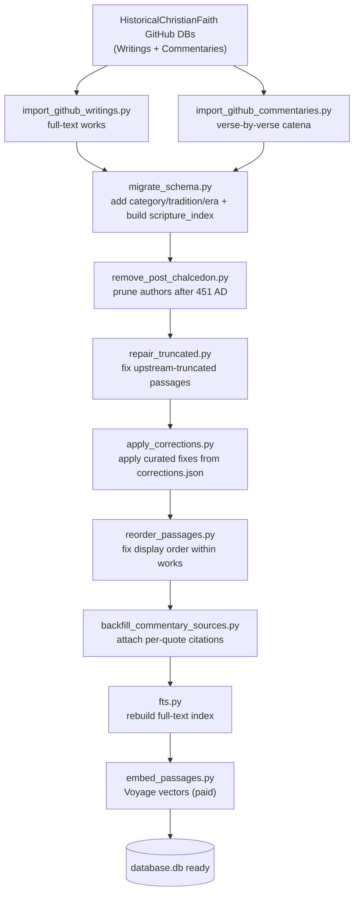
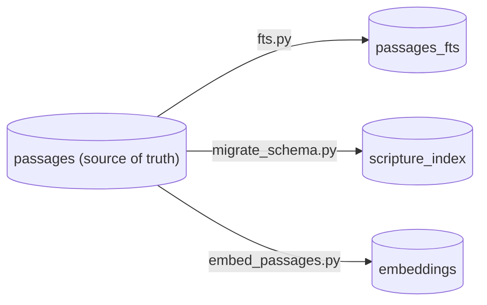

# Module 10 — The offline corpus pipeline (ETL)

**Goal:** understand how `database.db` is *built* — the data pipeline that takes raw source files and turns them into the clean, classified, indexed, embedded corpus the app serves. This is the "factory" from Module 1. The skill here is **ETL / data engineering for AI**: ingest messy data, transform it, and produce derived artifacts (search index, vectors) — exactly the work that feeds every RAG/search system.

Files: `tools/corpus/*`, plus the backend batch jobs `database.py` and `embed_passages.py` (Modules 3 and 5).

---

## 1. ETL in one breath

ETL = **Extract, Transform, Load.** Extract raw data from sources, Transform it into a clean shape, Load it into your store. This project's pipeline is a clean, ordered ETL run where each step does one transform and writes back to SQLite. The defining trait of the whole pipeline: it's **offline and run by hand** — none of it is imported by the running server (`tools/corpus/README.md:3`). The server only ever *reads* the finished `database.db`. Separating "build the data" from "serve the data" is the architectural decision that keeps the runtime small and the build reproducible.

## 2. The pipeline, in order

From `tools/corpus/README.md`, the build runs these scripts in sequence:



Read it as three phases:

1. **Extract / load (import).** `import_github_writings.py` and `import_github_commentaries.py` read the open-source [HistoricalChristianFaith](https://github.com/HistoricalChristianFaith) databases (cloned from GitHub) and insert authors/works/passages. The writings DB is full-text works; the commentaries DB is the ~53k verse-keyed catena entries (headers like `John 3:16`).
2. **Transform (classify, prune, repair).** `migrate_schema.py` adds the classification columns and builds `scripture_index` (Module 3). `remove_post_chalcedon.py` prunes authors after the Council of Chalcedon (451 AD) — the project's scope boundary. Then a series of *repair* steps fix real data defects.
3. **Derive (index, embed).** `fts.py` rebuilds the full-text index; `embed_passages.py` produces the Voyage vectors.

## 3. The "extract" step and scope filtering — `import_github_writings.py`

The importer's docstring (`:1`) tells you the source and the cutoff: ~245 **pre-Chalcedon** authors. The most interesting thing here is the **`EXCLUDED` set** (`:39`): an explicit list of medieval/reformation/post-Chalcedon authors (Aquinas, Luther, Calvin, Bede, John Damascene…) with their dates in comments. The corpus has a deliberate editorial boundary — "the early Church" means before 451 AD — and that boundary is enforced as data, not vibes. Defining and defending a dataset's scope is a real data-engineering responsibility; doing it as a reviewable, commented list is the right call.

Note also the importer's safety habits (from its options at `:10`): `--dry-run` (parse and count without writing) and `--no-backup` (it backs up the DB by default). A pipeline step that can mutate a 53k-row database should let you preview and should snapshot first.

## 4. The "repair" steps — real data is dirty

Three scripts exist purely because the upstream source has defects. This is the unglamorous 80% of data work, and the fact that it's *codified* (not done by hand-editing the DB) is what makes the corpus reproducible.

- **`repair_truncated.py`** — some HCF source files were truncated upstream (a treatise cut off mid-document). This detects and repairs them.
- **`apply_corrections.py`** — applies a curated list of fixes from `corrections.json`. Its docstring (`:1`) gives a concrete example: the Nicene Creed was reduced upstream to the fragment *"And in the Holy Ghost, etc."*, and several canon collections kept only their first canon. `corrections.json` holds the correct full text (from the same NPNF translation used throughout). Two design choices worth noting:
  - **Matched by `(author, work title)`** which is unique per entry; a correction that matches **zero or more-than-one** passage is *reported and skipped, not guessed* (`:18`). Refusing to act on an ambiguous match is exactly right — a silent wrong write is worse than a logged skip.
  - **Idempotent** (`:10`): it overwrites with the corrected text, so re-running is safe.
- **`reorder_passages.py`** — fixes passage display order within multi-part works (the order they read in, which the import didn't always preserve).
- **`backfill_commentary_sources.py`** — attaches real per-quote citations (`source_title`/`source_url`) to commentary passages, so the reader can link back to the original.

The pattern across all of them: **deterministic, idempotent, and conservative** (skip-on-ambiguous). That's the difference between a one-off hack and a maintainable pipeline.

## 5. The shared helpers

- **`scrape_utils.py`** — HTML parsing/cleanup helpers (the corpus copy of the text-cleaning logic; the runtime copy is `backend/utils.py`, deliberately separated so `backend/` doesn't import the scraping toolkit — see `utils.py:1`).
- **`db_path.py`** — resolves the path to `backend/database.db` so every script writes to the same file regardless of the directory it's run from. A tiny module, but centralizing the path means no script hardcodes it wrong.

## 6. The golden rule, again — rebuild derived tables (`README.md:26`)

This is the operational heart of the whole pipeline, repeated from Module 3 because it's *the* thing to remember:

> There are **no DB triggers.** Whenever a script changes passage text, headers, or rows, the derived tables go stale and **must** be rebuilt:
> ```bash
> python tools/corpus/fts.py            # full-text index
> python tools/corpus/migrate_schema.py # scripture_index (idempotent)
> python backend/embed_passages.py      # re-embed changed rows (paid)
> ```

Why no triggers? Triggers would re-run on every tiny write during a bulk import, making it crawl, and re-embedding is *paid* (you'd never want it to fire automatically). So the pipeline makes derivation an explicit, ordered final phase. The cost: you must remember to run it. The docs flag it loudly, and the importers' docstrings repeat the reminder. **The dependency direction is: `passages` is the source of truth; `passages_fts`, `scripture_index`, and `embeddings` are caches of it that you regenerate.**



## 7. Why this matters on a resume

When you say "I built a hybrid search system over 53k documents," the follow-up is "where did the data come from and how clean was it?" This pipeline is the answer:

- a **defined-scope** dataset (pre-Chalcedon, enforced in code),
- **idempotent, resumable** import and embed steps (re-runnable without double-charging or double-inserting),
- **conservative repair** with curated corrections and skip-on-ambiguous,
- a clear **source-of-truth → derived-artifacts** model with an explicit rebuild step.

Being able to talk about data provenance, idempotency, and the cost-awareness of re-embedding is what separates "I called an embeddings API once" from "I operate a corpus."

## 8. Check yourself

1. What does "offline pipeline" mean here, and why is it kept entirely separate from the running server?
2. Why is the post-Chalcedon `EXCLUDED` list in code rather than a manual one-time deletion?
3. `apply_corrections.py` skips a correction that matches zero or two passages instead of guessing. Why is that the safer behavior?
4. Why are there no database triggers, and what is the consequence you must remember after editing passages?
5. Which table is the source of truth, and which three are derived from it?
6. What makes the import and embed steps safe to re-run after an interruption?

Next: [Module 11 — SEO, build & deploy, CI](11-deploy-ci.md).
