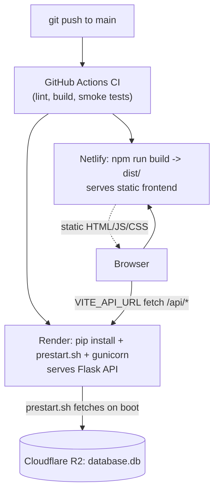
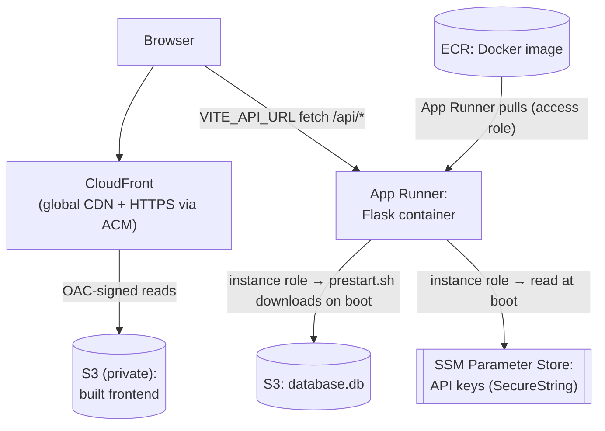

# Module 11 — SEO, build & deploy, CI

**Goal:** understand how the code becomes a live website — the build pipeline, the container, the cloud hosts, the boot-time database fetch, the CI gate, and how a JavaScript SPA gets found by Google. This is the "ops" layer: the part that turns a project into a *running product*, and the part most portfolios are missing.

Files: `tools/generate_seo.py`, `public/_redirects`, `public/_headers`, `netlify.toml`, `render.yaml`, `backend/Dockerfile`, `backend/prestart.sh`, `.github/workflows/ci.yml`, `backend/tests/*`, `docs/aws-migration-guide.md`.

---

## 1. The deployment picture (recap + detail)



Two independent deploys from one repo: the **frontend** (static files) on Netlify, the **backend** (Python) on Render. They're glued by `VITE_API_URL` (frontend knows the API's address) and CORS (API allows the frontend's origin, Module 4).

> **Update (2026) — migrated to AWS.** The "two deploys from one repo, glued by `VITE_API_URL` + CORS" model is unchanged, but the *hosts* changed: **CloudFront + S3** for the frontend, **App Runner** for the backend, **S3** for the database, **ECR/ACM/SSM/IAM** as supporting services. Sections 2–8 below still teach the fundamentals on the original Netlify/Render stack — the concepts map 1:1. **Section 9** covers the AWS specifics and the migration gotchas. The app code barely changed, which is itself the lesson (see 11.3–11.4).

## 2. The frontend build — Vite

`npm run build` (`vite build`) compiles the React source into a `dist/` folder of optimized static assets: minified JS bundles, CSS, hashed filenames for cache-busting, and the processed `index.html`. Static files are cheap and fast to serve from a CDN — there's no Node server running in production, just files. Everything in `public/` is copied verbatim into `dist/` (icons, `sitemap.xml`, `robots.txt`, `_headers`, `_redirects`, `theme-init.js`).

`netlify.toml` configures it:

```toml
[build]
  command = "npm run build"
  publish = "dist"
[build.environment]
  NODE_VERSION = "20"
```

`VITE_API_URL` is set in the Netlify dashboard (not committed), so the built bundle points at the real Render API. Recall the fail-fast guard in `api/client.js` (Module 2): build without it and the build errors.

### Two Netlify-only files

- **`public/_redirects`** — the **SPA fallback**: `/* /index.html 200`. Every unknown path serves the React app so client-side routing works on a hard refresh of `/read/123`. This is the CDN-level equivalent of the Flask `index.html` fallback (Module 7). Without it, deep links 404.
- **`public/_headers`** — **security headers for the HTML page itself**. The Flask `after_request` headers (Module 4) only cover API responses on the Render origin; this file protects the actual page served by Netlify. Its CSP is slightly looser than the API's because the page legitimately needs to: load the app bundle (`script-src 'self'` + the Cloudflare analytics beacon), inject Vite styles + Google Fonts (`style-src 'unsafe-inline' ...`), and **fetch the cross-origin API** (`connect-src 'self' https://*.onrender.com`). Note the comment: add your custom API domain here if you move off `onrender.com`. The same defense-in-depth posture, applied at the right layer. **(AWS:** CloudFront does *not* read `_headers` — that's a Netlify feature. On AWS these exact headers were recreated as a CloudFront **Response Headers Policy**, with `connect-src` repointed to `https://*.awsapprunner.com`. See Section 9 — this was gotcha #4.)

## 3. The backend container — `Dockerfile`

Even though Render runs native Python today, the repo ships a `Dockerfile` for the planned AWS move and for prod-parity testing. It's a textbook production Python image:

```dockerfile
FROM python:3.13-slim                       # small base image
ENV PYTHONDONTWRITEBYTECODE=1 PYTHONUNBUFFERED=1 ...   # clean, log-friendly Python
RUN apt-get install -y --no-install-recommends curl ca-certificates  # curl for prestart.sh
WORKDIR /app
COPY requirements.txt .                      # copy deps FIRST...
RUN pip install -r requirements.txt          # ...so this layer caches across code changes
COPY . .                                     # then the code
RUN useradd ... aetc && chown ... && USER aetc   # drop root privileges
EXPOSE 5001
CMD ["sh", "-c", "./prestart.sh && exec gunicorn -w 1 -b 0.0.0.0:${PORT:-5001} --timeout 60 app:app"]
```

Four things that signal production maturity:

- **Layer caching by copying `requirements.txt` first** (`:26`). Docker caches each step; deps are installed in their own layer *before* the app code is copied. So editing a `.py` file doesn't re-run `pip install` — only the cheap `COPY . .` layer rebuilds. Order your Dockerfile from least- to most-frequently-changed.
- **`--no-install-recommends` + `rm -rf /var/lib/apt/lists/*`** — keep the image small.
- **Non-root user** (`:33`). The container runs as `aetc` (uid 1000), not root. If the app is ever compromised, the attacker isn't root inside the container. This is a baseline container-security control that's easy to skip and important not to.
- **`prestart.sh && exec gunicorn`** — fetch the database, then hand off the process to gunicorn (`exec` replaces the shell so signals reach gunicorn cleanly).

## 4. Boot-time database hydration — `prestart.sh`

The database isn't in the image or in git (it's large and is data, not code). Instead it's fetched from object storage on boot:

```bash
set -euo pipefail                            # fail hard on any error / unset var
DB_FILE="${DB_FILE:-database.db}"
if [ -f "$DB_FILE" ]; then exit 0; fi        # idempotent: skip if already present
if [ -z "${DB_URL:-}" ]; then echo "ERROR..."; exit 1; fi
curl -fSL --retry 3 --retry-delay 2 -o "$DB_FILE" "$DB_URL"   # download with retries
if ! head -c 16 "$DB_FILE" | grep -q "SQLite format 3"; then  # sanity check
  rm -f "$DB_FILE"; exit 1
fi
```

Small script, lots of good instincts:

- **`set -euo pipefail`** — the bash equivalent of "don't continue after an error." `-e` exit on error, `-u` error on undefined variable, `-o pipefail` catch failures mid-pipe. Every serious bash script should start with this.
- **Idempotent** — if the file already exists (a persistent disk, local dev), skip the download.
- **Retries** — `curl --retry 3` handles transient network blips on boot.
- **Validation** — checks the SQLite magic header (`SQLite format 3`) and deletes the file if it's not a real database, so the app never boots on a truncated/HTML-error-page download. Validate what you download before trusting it.

The portability payoff (noted in the comments): `DB_URL` points at Cloudflare R2 today; R2 is S3-compatible, so the AWS move just repoints it at an S3 bucket — `prestart.sh` doesn't change. That's the whole reason the README can say "this same shape runs on AWS."

`render.yaml` (Module 1/4) wires it as the start command: `bash prestart.sh && gunicorn -w 1 --threads 8 ...`, with `healthCheckPath: /api/health` and all secrets as `sync: false`.

## 5. Continuous Integration — `.github/workflows/ci.yml`

CI runs on every push to `main` and every pull request, gating bad code before it ships. Two parallel jobs:

**`frontend` job** (`:50`):
```yaml
- run: npm ci          # clean, lockfile-exact install
- run: npm run lint    # ESLint — same check you run locally
- run: npm run build   # verify the production build compiles (with a placeholder VITE_API_URL)
```
This catches lint errors and build breaks (a bad import, a syntax error) before they reach Netlify. `npm ci` (not `npm install`) installs exactly what's in the lockfile — reproducible CI.

**`backend` job** (`:9`):
```yaml
- setup-python 3.13 (cache: pip)
- pip install -r requirements.txt
- fetch test database via prestart.sh (if DB_URL secret set)
- pytest -q  (if database.db present)
```

Notice the **graceful skip** (`:30`, `:44`): if the `DB_URL` secret isn't configured (e.g. on a fork's PR), it logs and skips the DB-dependent tests instead of failing the build. Tests degrade rather than break — the same philosophy as the runtime.

`cache: pip` / `cache: npm` speed up CI by caching dependencies between runs. Running CI in **parallel jobs** (frontend and backend at once) keeps the feedback loop short.

## 6. The smoke tests — `backend/tests/test_smoke.py`

These aren't exhaustive unit tests; they're **smoke tests** — "does the thing turn on without smoke?" They run against a real `database.db` to catch deploy regressions:

```python
def test_health(client):
    r = client.get("/api/health")
    assert r.status_code == 200
    assert r.get_json()["embeddings_loaded"] > 0   # embeddings actually loaded

def test_search_too_long(client):
    r = client.get("/api/search?q=" + "a"*501)
    assert r.status_code == 400                     # the query cap fires

def test_security_headers_present(client):
    r = client.get("/api/health")
    assert r.headers["X-Content-Type-Options"] == "nosniff"
    assert r.headers["X-Frame-Options"] == "DENY"   # security middleware fires
```

They use Flask's **`test_client()`** (`:24`) — an in-process fake HTTP client, no real server needed. The fixture imports `app` lazily (`:22`) so missing API keys don't crash test collection. What they verify is well-chosen: the app boots, the DB is wired (`embeddings_loaded > 0`, authors load), the query cap returns 400, unknown ids 404, and the security headers fire. That last one — *testing that your security middleware is actually present* — is a great habit; security controls silently disappearing is a classic regression.

`test_parsing.py` (the other test file) unit-tests the pure functions — `prepare_fts_query`, `detect_author_local`, `parse_scripture_ref`, the RRF/diversify logic — exactly the modules that were deliberately kept pure (no DB/network) in Modules 5-6 so they'd be testable. Pure functions → easy tests is a payoff of that design.

## 7. SEO — making an SPA findable — `tools/generate_seo.py`

A single-page app is mostly an empty HTML shell that JavaScript fills in. Search-engine crawlers see that near-empty shell and have little to index — the search box itself isn't crawlable. So this script generates **crawlable assets from `database.db`** (no API keys needed — it reads the DB directly):

- **`public/sitemap.xml`** — ~2,997 URLs (every `/read/:workId` work, topic pages, static pages) so Google can discover all the content.
- **`public/seo/topics.json`** — content for the `/topics/:slug` landing pages: real passage excerpts per father/subject (the `TOPICS` list at `:40`). These pages give Google *actual patristic text* to index instead of an empty shell — that's what can rank for "what did Augustine teach about grace."
- **`public/seo/site.json`** — site metadata for JSON-LD structured data (`SeoJsonLd.jsx` injects a `SearchAction` so Google can show a search box for the site).

Combined with the per-route `usePageMeta` (Module 8) that sets `<title>`/description/canonical/Open Graph tags per page, this is a complete "SPA SEO" story. Regenerate after corpus changes: `SITE_URL=... npm run generate:seo`. The `theme-init.js` in `public/` is a tiny external script (external so it complies with the strict CSP) that applies the saved theme *before* the page paints, preventing a flash — a perf/polish detail.

## 8. The full path from commit to live

1. `git push origin main`
2. **CI** lints, builds the frontend, runs backend smoke tests (gate).
3. **Netlify** runs `npm run build`, publishes `dist/` to its CDN.
4. **Render** runs `pip install`, then `prestart.sh` (fetch DB from R2), then boots gunicorn; pings `/api/health` to confirm.
5. Browser loads the static frontend from Netlify; the frontend calls the Render API; the API serves from the in-RAM embeddings + SQLite.

## 9. The AWS migration — same shapes, managed services

In 2026 the stack moved off Netlify/Render/Cloudflare-R2 onto AWS. The headline is that the *application* barely changed — the portability was designed in: `prestart.sh`'s `DB_URL` abstraction (11.4) and the container (11.3) meant the same image and boot script run on a new host. The full runbook is `docs/aws-migration-guide.md`.



### The 1:1 mapping

| Concept | Netlify / Render | AWS |
|---|---|---|
| Static frontend host | Netlify CDN | **S3 (private) + CloudFront** |
| SPA fallback (`_redirects`) | Netlify `/* /index.html 200` | CloudFront **custom error responses** (403/404 → `/index.html`, 200) |
| Page security headers (`_headers`) | Netlify reads the file | CloudFront **Response Headers Policy** |
| Backend host | Render | **App Runner** (runs the same `Dockerfile`) |
| Backend image | Render builds from repo | Built locally, pushed to **ECR** (private Docker registry) |
| `database.db` storage | Cloudflare R2 | **S3** (same `s3://`-vs-`https` branch in `prestart.sh`) |
| Secrets | Render env vars | **SSM Parameter Store** (SecureString) |
| HTTPS certificate | Netlify auto | **ACM** (must be in `us-east-1` for CloudFront) |
| Cloud credentials | — | **IAM roles** (no long-lived keys anywhere) |

### Three concepts worth naming in an interview

- **Private bucket + OAC.** The frontend bucket blocks *all* public access; only CloudFront can read it, via an **Origin Access Control** (a SigV4 signature CloudFront adds). Users never touch S3 directly. Same for the DB bucket. This is the modern replacement for the older "Origin Access Identity."
- **IAM roles over keys.** The running container is handed an **instance role** scoped to exactly what it needs — read *one* S3 object and *three* SSM parameters (least privilege). App Runner separately gets an **access role** to pull the image from ECR. No AWS access keys are stored in the image, repo, or env.
- **Read-modify-write for infra changes.** Every CloudFront/App Runner change fetched the full live config, changed *one* field, and pushed it back with its version tag (`ETag` / describe-then-update) — so unrelated settings can't be silently clobbered. The AWS scratch configs used for this are git-ignored (they hold account IDs, not secrets).

### The four gotchas (the best debugging stories)

All four surfaced as the same misleading `CREATE_FAILED` / "health check failed — check your port number." The real signal lived in the logs — and when there were **no application logs at all**, that absence was itself the clue: the container never started, so the problem was the image/secrets/architecture, not the app. Documented in `docs/aws-migration-guide.md`:

1. **SecureString secrets need `kms:Decrypt`**, not just `ssm:GetParameters` — the instance role must also be allowed to use the KMS key that encrypts the parameters, or injection fails before the app boots.
2. **Docker buildx attestations break App Runner.** Modern Docker Desktop pushes an OCI *image index* with a provenance/attestation manifest that App Runner can't launch. Build with `--provenance=false --sbom=false` so ECR gets a single-platform image.
3. **App Runner is x86_64-only.** An arm64 image (the default on Apple Silicon) dies instantly with `exec format error`. Build with `--platform linux/amd64` regardless of your dev machine.
4. **Security headers don't carry over.** `_headers` is Netlify-specific; on CloudFront they must be recreated as a Response Headers Policy (with `connect-src` updated to `*.awsapprunner.com`).

### Where things live now

- **App Runner** (us-east-2): service `ask-the-early-church-api` → status, URL, env vars, Logs tab.
- **S3**: `ask-the-early-church-db-…` (database), `ask-the-early-church-frontend-…` (built site).
- **ECR** (us-east-2): repo `ask-the-early-church-api`.
- **CloudFront**: distribution `EORM180KT9LTZ` (aliases `asktheearlychurch.com` + `www`).
- **ACM** (us-east-1), **IAM** roles `AppRunnerECRAccessRole` / `AppRunnerS3ReadInstanceRole`, **SSM** params under `/ask-the-early-church/*`.

> **Cutover status:** the AWS stack is fully built and verified in parallel; the final step is the DNS switch in Cloudflare (apex + `www` → the CloudFront domain), after which Render/Netlify are decommissioned.

## 10. Check yourself

1. Why are there two separate deploys (frontend + backend) from one repo, and what two mechanisms glue them together?
2. What do `public/_redirects` and `public/_headers` each do, why can't the Flask `after_request` headers cover the HTML page, and what are their AWS/CloudFront equivalents?
3. In the Dockerfile, why is `requirements.txt` copied and installed *before* the app code? Why run as a non-root user?
4. List three robustness features of `prestart.sh` and explain `set -euo pipefail`.
5. What's a "smoke test," and why is asserting the security headers are present a valuable one?
6. Why does a single-page app need a generated sitemap and topic pages to be found by Google?
7. The app moved to AWS with almost no code changes — which two design decisions (from 11.3 and 11.4) made it portable, and what AWS service does each original piece (Netlify, Render, R2, `_headers`, secrets) map to?
8. Why does giving the instance role `ssm:GetParameters` alone fail to inject a SecureString secret, and what pattern explains why the failure produced *zero* application logs?

Next: [Module 12 — Ownership & interview prep](12-ownership.md).
