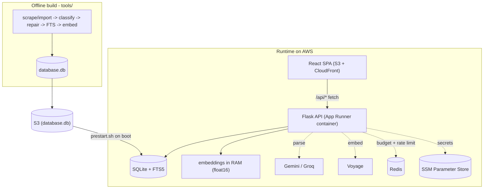

# Module 12 — Ownership & interview prep

**Goal:** turn everything you've learned into the ability to *talk about it*. Owning a project for a resume isn't reciting files — it's telling a coherent story about the system, defending the trade-offs, and answering follow-ups. This module is your script.

---

## 1. The 60-second system pitch (memorize this)

> Ask the Early Church is a full-stack hybrid-search application over a 53,000-passage corpus of early Christian writings. The frontend is a React SPA hosted on S3 behind CloudFront; the backend is a containerized Flask API on AWS App Runner that loads pre-computed embeddings into RAM and serves search over SQLite with FTS5. A search parses the query (Gemini, with Groq and a free local fallback), embeds it with Voyage, and fuses three signals — vector similarity, FTS5 keyword, and title match — using reciprocal rank fusion, then diversifies the results. Scripture references short-circuit to a direct verse-index lookup. The whole AI path is wrapped in caching and a Redis-backed monthly budget cap so it costs about a dollar a month, and it degrades to keyword-only search rather than ever failing. There's also an offline ETL pipeline that builds and embeds the corpus, security hardening across the stack, CI, and a fully containerized AWS deployment (ECR image → App Runner, S3-hosted database, S3 + CloudFront frontend, secrets in SSM Parameter Store).

That paragraph hits: full-stack, RAG/hybrid search, LLM-with-fallbacks, cost control, graceful degradation, data pipeline, security, ops. Practice it out loud until it's natural.

## 2. The architecture you can draw from memory

## 3. The trade-offs you must be able to defend

Interviewers probe *why*, not *what*. For each decision, know the alternative you rejected and the reason.

| Decision | Why this | What you gave up / when you'd change |
|---|---|---|
| **SQLite, not Postgres** | Corpus is read-only, single-node, fits on disk. Zero ops overhead. | No concurrent writers, no horizontal DB scaling. Change if data became write-heavy or multi-node. |
| **Embeddings in RAM, not a vector DB** | 53k vectors is tiny (~108 MB at float16); a numpy dot-product is fast and free. | Doesn't scale to millions of vectors. Change to a vector DB (pgvector, Pinecone) at much larger scale. |
| **float16 store + chunked float32 scoring** | Halves memory (originally to fit Render's 512 MB free plan; still keeps the App Runner container lean and cheap); precision loss is immaterial for top-k. | Tiny precision loss. The chunked scoring is required so the multiply doesn't re-inflate to float32. |
| **Reciprocal Rank Fusion** | Scale-free — fuses cosine + BM25 + title without normalizing incompatible scores. Almost parameter-free. | Ignores score magnitude (only rank). Fine here; a learned ranker would need training data. |
| **One gunicorn worker, 8 threads** | Keeps one shared copy of the embedding matrix in RAM; workload is I/O-bound so threads add concurrency. | Can't use multiple cores for CPU work. Scale to multi-worker + Redis on a bigger box. |
| **LLM only for topic; local author detection** | Author detection is a lookup, not reasoning — don't pay a model for it. Cut token cost dramatically. | Local detection skips ambiguous names; the LLM tier recovers those. |
| **Gemini → Groq → local fallback** | Never fail a search because one provider is down or the budget is spent. | More code paths. Worth it for reliability. |
| **Budget cap fails *open*** | Better to serve a query than 500 because Redis is down. | The cap only bites when Redis is configured; without it, caching alone bounds spend. |
| **Allowlist HTML sanitizer + CSP** | Corpus is stored HTML; allowlist (not blocklist) is the only safe way to render it. CSP is the backstop. | More work than `innerHTML`. Non-negotiable for XSS safety. |
| **localStorage bookmarks (no backend)** | Zero-backend MVP; instant; survives refresh. | No cross-device sync. The mobile-app roadmap moves this to real accounts. |

## 4. Likely interview questions (with the angle to take)

**"Walk me through what happens when a user searches."**
Use the request-lifecycle diagram from Module 1/6: cap → scripture short-circuit → parallel parse+embed → hybrid RRF → diversify → fetch → re-sort. Mention the parallelism and the fallbacks.

**"How does the semantic search actually work?"**
Embeddings represent meaning as vectors; cosine similarity (= dot product on normalized vectors) finds passages near the query vector. Vectors are precomputed offline (Voyage), stored as float16 in RAM, scored with numpy. (Module 5.)

**"What's reciprocal rank fusion and why use it?"**
You have three signals on incompatible scales (cosine 0-1, BM25 unbounded). RRF uses each item's *rank* not its *score*, summing `weight/(k+rank)` across lists — so it fuses without normalization and rewards items that rank well in multiple signals. (Module 6.)

**"How do you control AI cost?"**
Three layers: aggressive 30-day TTL caches on the paid calls (a repeated query costs nothing), a Redis-backed monthly budget that degrades to keyword-only when exhausted, and a 500-char query cap. Plus moving author detection off the LLM. (Module 5.)

**"How is it secured?"**
Walk the Module 4 table: CORS allowlist, rate limiting (with ProxyFix for real client IPs), parameterized SQL + FTS tokenizer, allowlist HTML sanitizer + CSP, security headers, path-traversal guard, generic error responses, secrets in env/Keychain, non-root container.

**"What happens if Gemini/Voyage/Redis goes down?"**
Nothing fatal. Gemini down → Groq → local parse. Voyage down → keyword-only search. Redis down → budget fails open, rate limits fall back to per-process. The app never 500s on a dependency failure. (Modules 5-6.)

**"How would you scale this to 10x the corpus / traffic?"**
Corpus 10x (~500k vectors): still fits RAM at float16 (~1 GB) on a bigger instance (App Runner scales up to 4 vCPU / 12 GB); beyond that, move to a vector DB. Traffic: multi-worker gunicorn + Redis (ElastiCache) for shared rate-limit/budget, and App Runner's built-in autoscaling across instances — or move to ECS/EKS for finer control. Be honest about the single-node ceiling.

**"What was the hardest/most interesting part?"**
Good answers: the float16 streaming loader (fitting 53k vectors in 512 MB without a 3x memory spike), or the parallel embed+parse latency optimization, or designing the three-tier graceful degradation. Pick one and go deep.

**"What would you do differently / what's next?"**
The AWS migration is **done** — App Runner + S3 + CloudFront + SSM, DNS cut over, Render and Netlify decommissioned (Module 11 §9). The project is now in maintenance mode, so the honest answer is about *known weak spots and what maintenance looks like*, which is Module 13: a ghost `/api/synthesize` still documented but never implemented, an `og-image.png` that exists only in S3 and not in git, dead CSS and an inert scroll-reveal hook in the frontend, and FTS-rebuild logic duplicated four ways across the ETL scripts. The roadmap beyond that: trim cold-start latency, UI polish, then monetization (donations, affiliate links, the mobile app with a corpus-trained AI assistant). The `npm audit`/Vite advisory is a known, scoped deferral.

Naming specific, prioritized flaws — and being able to say which ones change behavior versus which are just untidy — reads far better than "nothing much." Module 13 §5 ranks them for exactly this purpose.

## 5. Resume bullets (draft — adapt the numbers to truth)

- Built a full-stack hybrid-search app (React/Vite + Flask/SQLite) over a 52,869-passage corpus, fusing Voyage vector embeddings, SQLite FTS5 keyword search, and title matching via reciprocal rank fusion with per-work/author diversification.
- Engineered a memory-lean embedding loader (streamed float16 matrix, chunked float32 scoring) to serve 52k+ vectors in RAM within a 512 MB-class instance; warmed the query embedding in parallel with LLM query-parsing to cut search latency to roughly the slower of the two calls.
- Implemented LLM query parsing (Gemini 2.5 Flash-Lite) with Groq and zero-cost local fallbacks, 30-day TTL caching, and a Redis-backed monthly budget cap, keeping AI spend near $1/month while degrading gracefully to keyword-only search on any provider failure.
- Hardened a public API with rate limiting (real-client-IP via ProxyFix), CORS allowlisting, parameterized SQL + FTS-injection guards, an allowlist HTML sanitizer plus CSP, and path-traversal protection; gated on GitHub Actions CI (lint, build, pytest smoke tests).
- Designed an idempotent offline ETL pipeline (import → classify → repair → index → embed) and a fully containerized AWS deployment (Docker image in ECR → App Runner, S3 + CloudFront frontend with Origin Access Control, S3-hosted database, secrets in SSM Parameter Store, ACM/HTTPS) with boot-time DB hydration and SEO generation (~2,870-URL sitemap + topic landing pages).

## 6. Concept glossary (the durable, transferable vocabulary)

- **SPA / client-side routing** — one HTML shell; JS swaps views per URL. Needs server/CDN fallback to `index.html`.
- **Embedding** — vector representation of meaning; similar text → similar vectors.
- **Cosine similarity** — angle between vectors; = dot product when normalized.
- **RAG (Retrieval-Augmented Generation)** — retrieve relevant docs, then (optionally) feed them to an LLM. This app owns the retrieval half.
- **Hybrid search** — combine semantic (vector) + lexical (keyword) retrieval.
- **BM25** — standard keyword relevance score (FTS5's `rank`).
- **Reciprocal Rank Fusion** — combine ranked lists by summing `1/(k+rank)`; scale-free.
- **FTS5 external-content table** — search index that doesn't duplicate the source text (`content=''`).
- **Graceful degradation / fail open** — keep serving (at reduced quality) instead of erroring.
- **Idempotent** — running it twice does no extra harm.
- **CORS / CSP / HSTS / XSS / SQL injection / path traversal** — the web security vocabulary from Module 4/9.
- **CI/CD** — automated lint/build/test gate before deploy.
- **ETL** — extract, transform, load — the data pipeline pattern.
- **WSGI / gunicorn / reverse proxy / ProxyFix** — how Python web apps run behind a proxy in production.

## 7. Your study path from here

1. **Run it locally** (Module 2). Nothing cements understanding like seeing it boot and breaking it on purpose.
2. **Trace one real search** with the browser network tab open and the Flask logs visible. Watch the request, the JSON envelope, the AI-call log lines.
3. **Make a small change** — add a field to the search response, tweak an RRF weight in `ranking.py` and observe the result order, add a smoke test. Owning means modifying.
4. **Re-read each module's "Check yourself"** and answer out loud. If you can't, reopen that file.
5. **Do a mock interview** using section 4 above.

You've now been through every part of the system. The code is no longer a black box — it's a set of decisions you can explain and defend. That's ownership.

Back to the [index](README.md).
